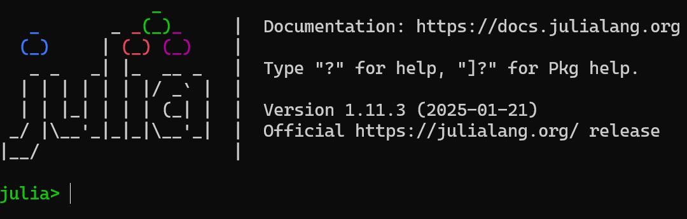
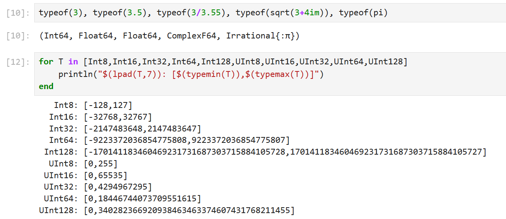
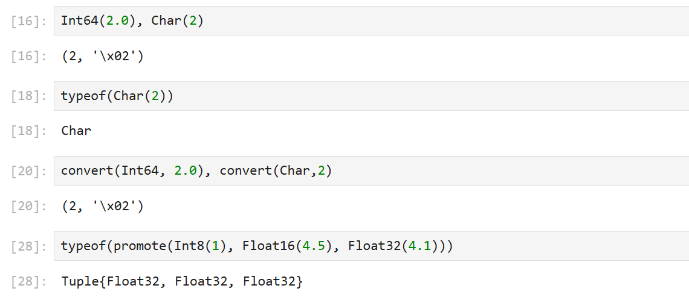
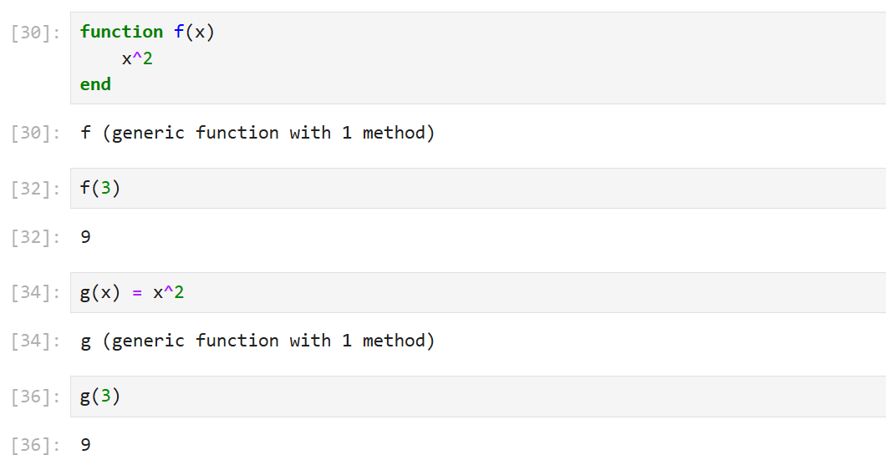
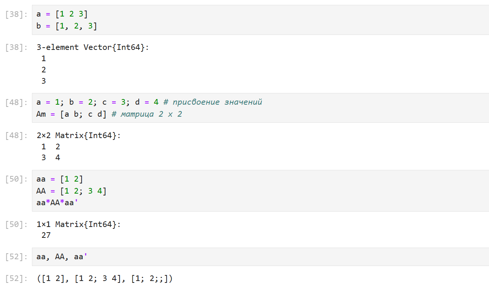
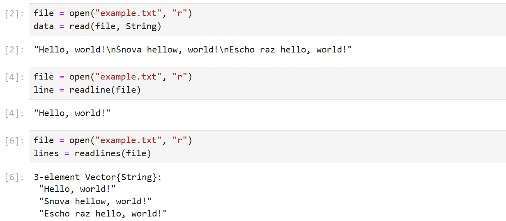
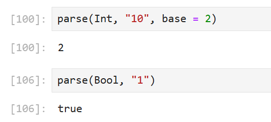
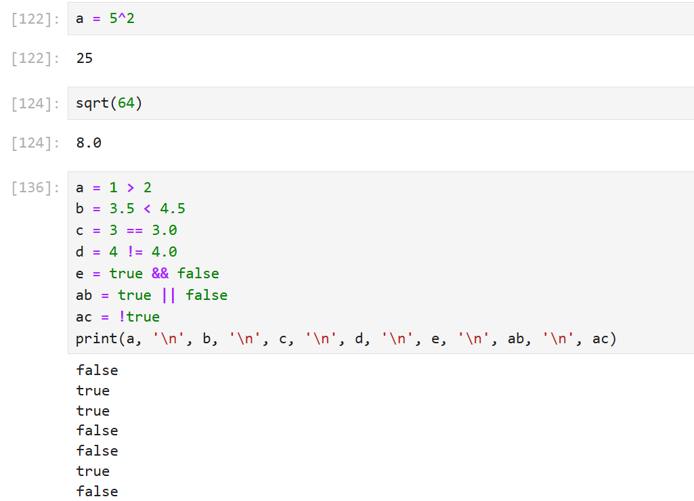
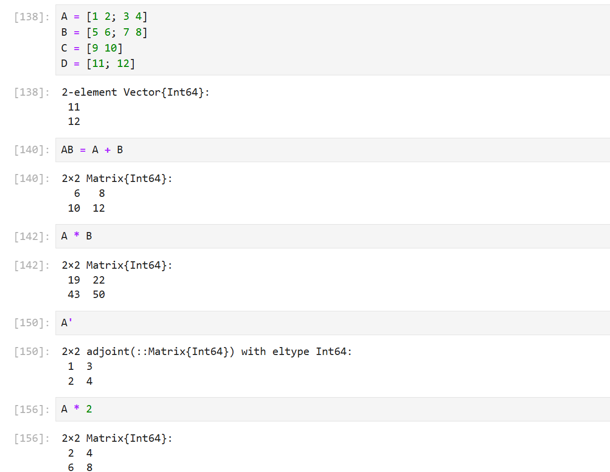

---
## Front matter
lang: ru-RU
title: Лабораторная работа №1 
subtitle: Компьютерный практикум по статистическому анализу данных
author:
  - Канева Екатерина, НФИбд-02-22
institute:
  - Российский университет дружбы народов, Москва, Россия
date: 13 сентября 2025

## i18n babel
babel-lang: russian
babel-otherlangs: english

## Formatting pdf
toc: false
toc-title: Содержание
slide_level: 2
aspectratio: 169
section-titles: true
theme: metropolis
header-includes:
 - \metroset{progressbar=frametitle,sectionpage=progressbar,numbering=fraction}
---

# Информация

## Докладчик

* Канева Екатерина Павловна
* студент группы НФИбд-02-22
* Российский университет дружбы народов
* [1132222004@rudn.ru](mailto:1132222004@rudn.ru)
* <https://nevseros.github.io/ru/>

# Вводная часть

## Цель работы

Подготовить рабочее пространство и инструментарий для работы с языком программирования Julia, на простейших примерах познакомиться с основами синтаксиса Julia.

## Задания

* Установить Julia
* Познакомиться с синтаксисом языка Julia
* Выполнить задания для самостоятельной работы

# Выполнение работы

## Установка Julia

Julia уже была установлена:

{width=50%}

## Примеры определения типа величин

Выполнила примеры с определением типа числовых величин:

{width=50%}

## Примеры приведения к одному типу

Выполнила примеры с приведением аргументов к одному типу:

{width=50%}

## Функции

Выполнила примеры с определением функций:

{width=50%}

## Массивы

Потом я поработала с массивами:

{width=70%}

## Первое задание для самостоятельной работы

Выполнила первое задание, используя команды read, readline, readlines, write, show, print, println:

{width=50%}

## Второе задание для самостоятельной работы

Изучила документацию по команде parse и выполнила несколько действий с ней:

{width=40%}

## Третье задание для самостоятельной работы

Выполнила действия с численными переменными:

{width=40%}

## Операции с матрицами

Проделала операции с матрицами:

{width=40%}

# Заключение

## Вывод

Познакомилась с синтаксисом языка Julia.