---
## Front matter
title: "Отчёт по лабораторной работе №1"
subtitle: "Компьютерный практикум по статистическому анализу данных"
author: "Канева Екатерина, НФИбд-02-22"

## Generic otions
lang: ru-RU
toc-title: "Содержание"

## Bibliography
bibliography: bib/cite.bib
csl: pandoc/csl/gost-r-7-0-5-2008-numeric.csl

## Pdf output format
toc: true # Table of contents
toc-depth: 2
lof: true # List of figures
lot: true # List of tables
fontsize: 12pt
linestretch: 1.5
papersize: a4
documentclass: scrreprt
## I18n polyglossia
polyglossia-lang:
  name: russian
  options:
	- spelling=modern
	- babelshorthands=true
polyglossia-otherlangs:
  name: english
## I18n babel
babel-lang: russian
babel-otherlangs: english
## Fonts
mainfont: IBM Plex Serif
romanfont: IBM Plex Serif
sansfont: IBM Plex Sans
monofont: IBM Plex Mono
mathfont: STIX Two Math
mainfontoptions: Ligatures=Common,Ligatures=TeX,Scale=0.94
romanfontoptions: Ligatures=Common,Ligatures=TeX,Scale=0.94
sansfontoptions: Ligatures=Common,Ligatures=TeX,Scale=MatchLowercase,Scale=0.94
monofontoptions: Scale=MatchLowercase,Scale=0.94,FakeStretch=0.9
mathfontoptions:
## Biblatex
biblatex: true
biblio-style: "gost-numeric"
biblatexoptions:
  - parentracker=true
  - backend=biber
  - hyperref=auto
  - language=auto
  - autolang=other*
  - citestyle=gost-numeric
## Pandoc-crossref LaTeX customization
figureTitle: "Рис."
tableTitle: "Таблица"
listingTitle: "Листинг"
lofTitle: "Список иллюстраций"
lotTitle: "Список таблиц"
lolTitle: "Листинги"
## Misc options
indent: true
header-includes:
  - \usepackage{indentfirst}
  - \usepackage{float} # keep figures where there are in the text
  - \floatplacement{figure}{H} # keep figures where there are in the text
---

# Цель работы

Подготовить рабочее пространство и инструментарий для работы с языком программирования Julia, на простейших примерах познакомиться с основами синтаксиса Julia.

# Задание

* Установить Julia
* Познакомиться с синтаксисом языка Julia
* Выполнить задания для самостоятельной работы

# Теоретическая часть

Julia - высокоуровневый свободный язык программирования с динамической типизацией, созданный для математических вычислений. Эффективен также и для написания программ общего назначения. Синтаксис языка схож с синтаксисом других математических языков, однако имеет некоторые существенные отличия.

Для выполнения заданий была использована официальная документация Julia.

# Выполнение лабораторной работы

У меня уже была установлена Julia (она была установлена через chocolatey), поэтому я сразу приступила к знакомству с синтаксисом (рис. [-@fig:1]):

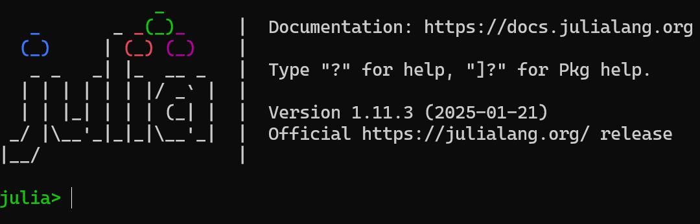{#fig:1 width=70%}

Сначала я выполнила примеры с определением типа числовых величин (рис. [-@fig:2]):

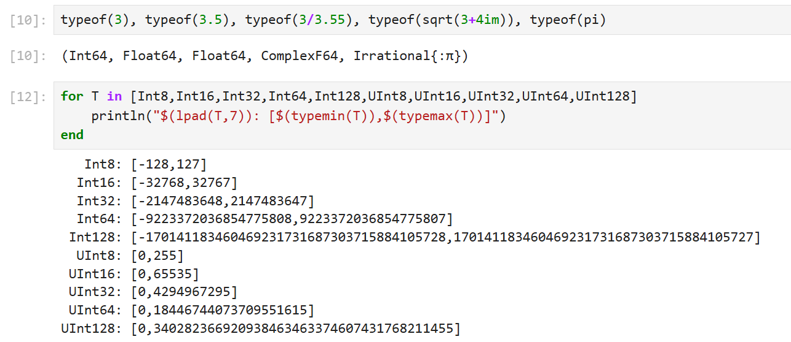{#fig:2 width=70%}

Потом я выполнила примеры с приведением аргументов к одному типу (рис. [-@fig:3]):

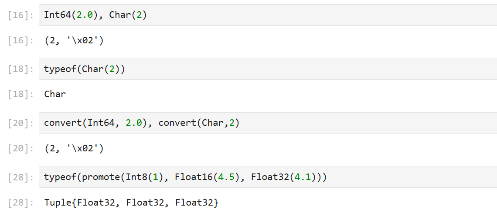{#fig:3 width=70%}

Далее я выполнила примеры с определением функций (рис. [-@fig:4]):

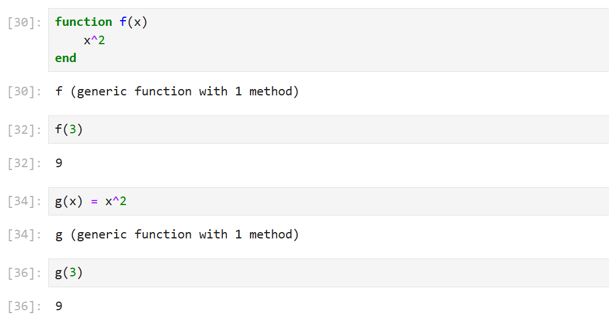{#fig:4 width=70%}

Потом я поработала с массивами (рис. [-@fig:5]):

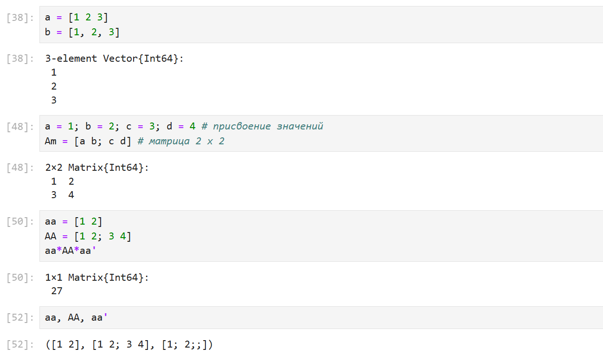{#fig:5 width=70%}

Изучим документацию по основным функциям Julia для чтения / записи / вывода информации на экран: `read, readline, readlines, readdlm, print, println, show, write`. Приведем свои примеры их использования, поясняя особенности их применения.

Для того, чтобы ознакомиться с документацией достаточно поставить знак ? перед интересующей функцией. Пример с изучением документации о команде read() (рис. [-@fig:6]):

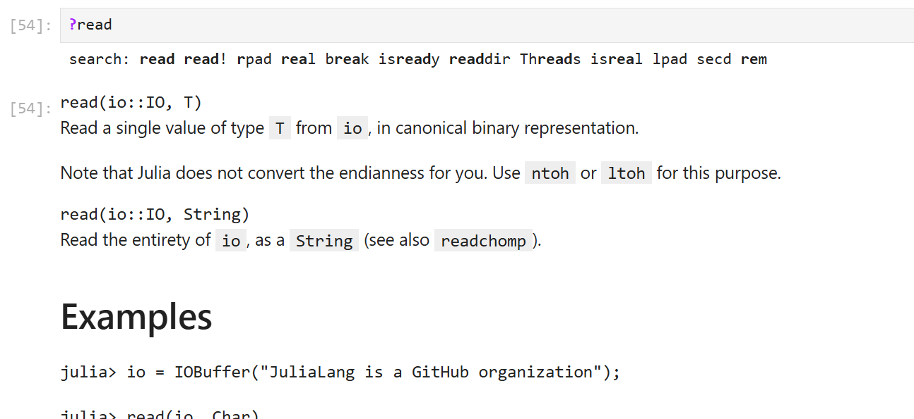{#fig:6 width=70%}

Создадим текстовый файл с любым содержанием в папке, где мы работаем. Откроем его на чтение и прочитаем с помощью команды `read`. Текст вывелся в одну строку с разделителями `\r\n`. Также прочитаем текст используя функцию `readline` - выведется только первая строка. Чтобы прочитать все строки в файле используем команду `readlines` (рис. [-@fig:7]):

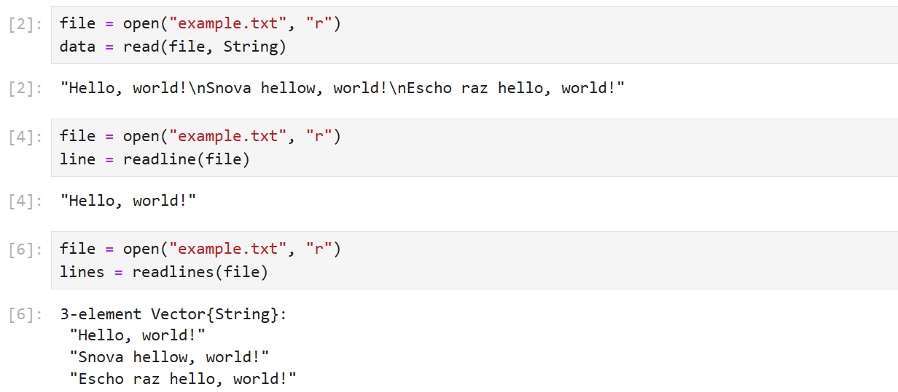{#fig:7 width=70%}

Далее проделаем действия с командами write и show (рис. [-@fig:8]):

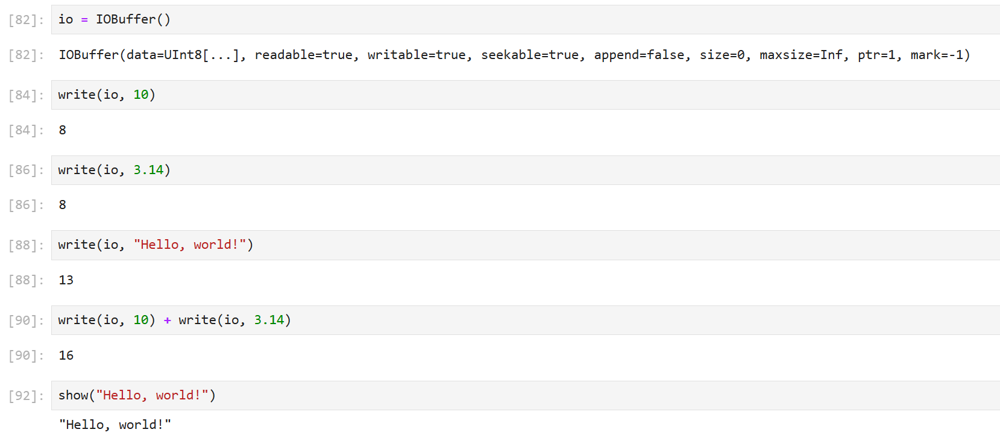{#fig:8 width=70%}

Также выполню действия с print и println (рис. [-@fig:9]):

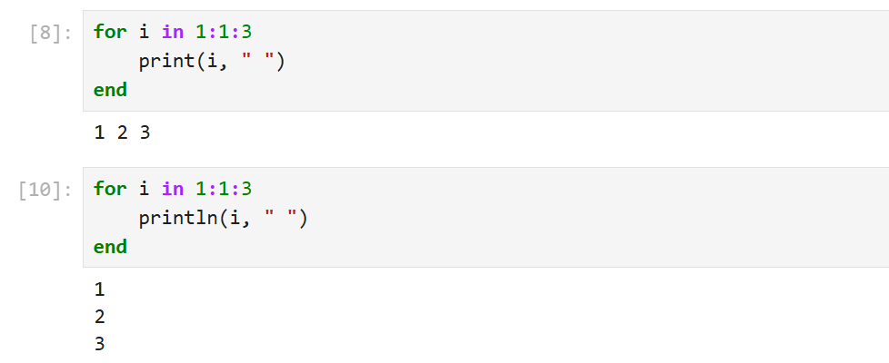{#fig:9 width=70%}

После этого я изучила документацию по команде parse и выполнила несколько действий с ней (рис. [-@fig:10]):

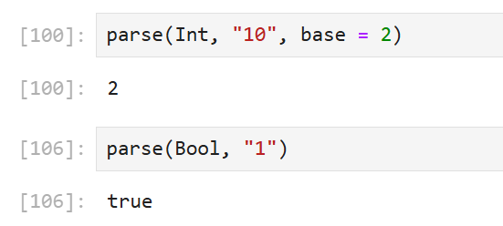{#fig:10 width=70%}

Потом я приступила к дйествиям с численными переменными: сложением, вычитанием, умножением, делением (рис. [-@fig:11]), возведение в степень, извлечение корня, сравнение, логические операции (рис. [-@fig:12]):

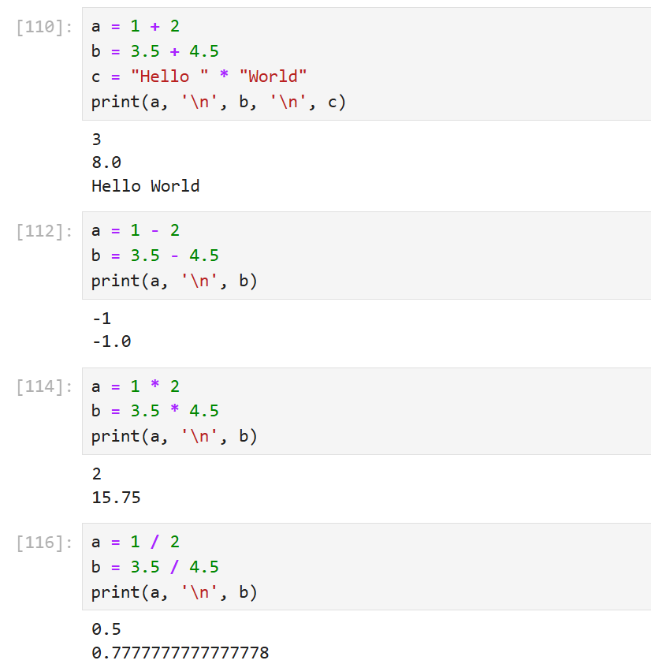{#fig:11 width=70%}

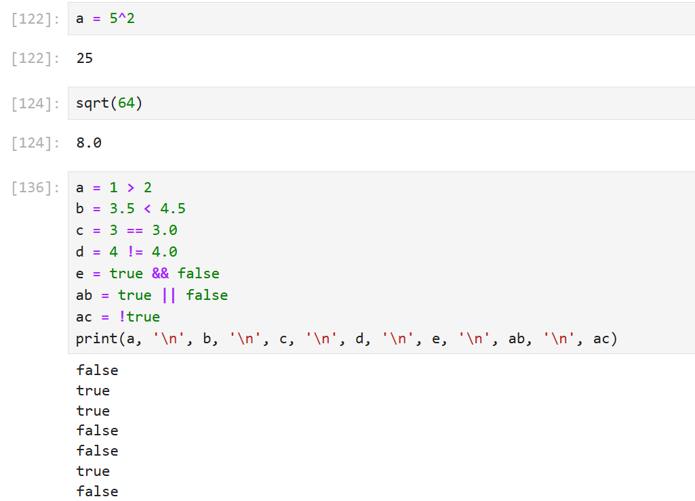{#fig:12 width=70%}

В заключение я проделала операции с матрицами: сложение, вычитание, скалярное произведение, транспонирование, умножение на скаляр (рис. [-@fig:13]):

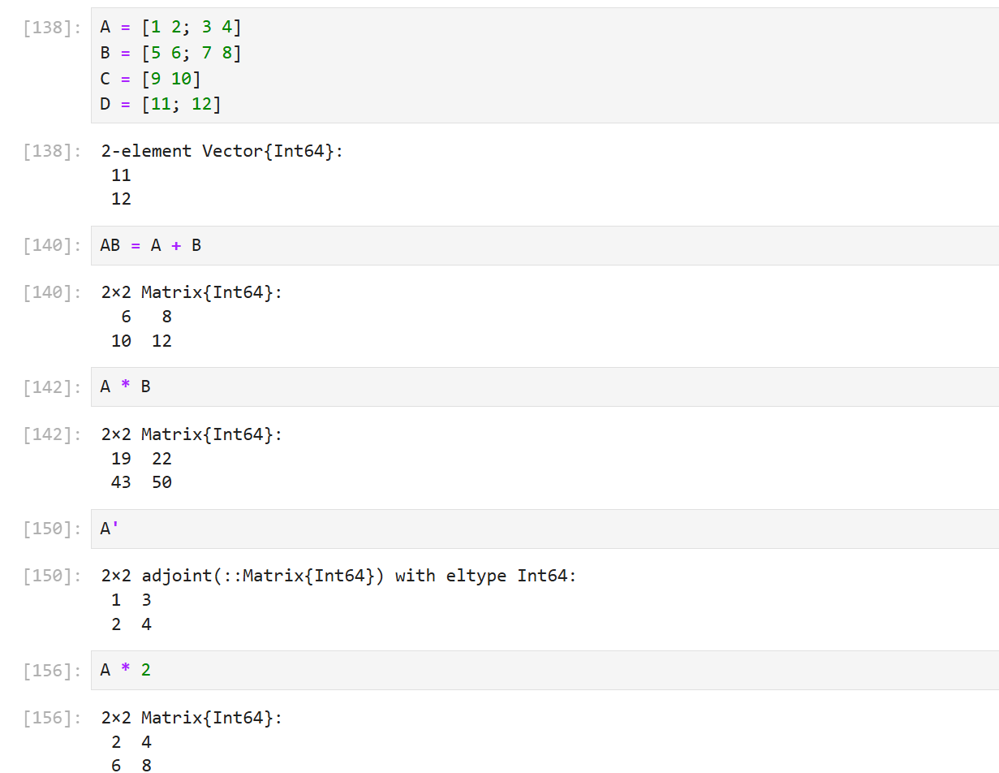{#fig:13 width=70%}

# Выводы

Познакомилась с синтаксисом языка Julia.