---
## Front matter
lang: ru-RU
title: Лабораторная работа №2
subtitle: Компьютерный практикум по статистическому анализу данных
author:
  - Канева Екатерина, НФИбд-02-22
institute:
  - Российский университет дружбы народов, Москва, Россия
date: 27 сентября 2025

## i18n babel
babel-lang: russian
babel-otherlangs: english

## Formatting pdf
toc: false
toc-title: Содержание
slide_level: 2
aspectratio: 169
section-titles: true
theme: metropolis
header-includes:
 - \metroset{progressbar=frametitle,sectionpage=progressbar,numbering=fraction}
---

# Информация

## Докладчик

* Канева Екатерина Павловна
* студент группы НФИбд-02-22
* Российский университет дружбы народов
* [1132222004@rudn.ru](mailto:1132222004@rudn.ru)
* <https://nevseros.github.io/ru/>

# Вводная часть

## Цель работы

Основная цель работы — изучить несколько структур данных, реализованных в Julia, научиться применять их и операции над ними для решения задач

## Задания

* Используя Jupyter Lab, повторить примеры.
* Выполнить задания для самостоятельной работы.

# Выполнение работы

## Примеры с кортежами

Выполнила примеры с кортежами:

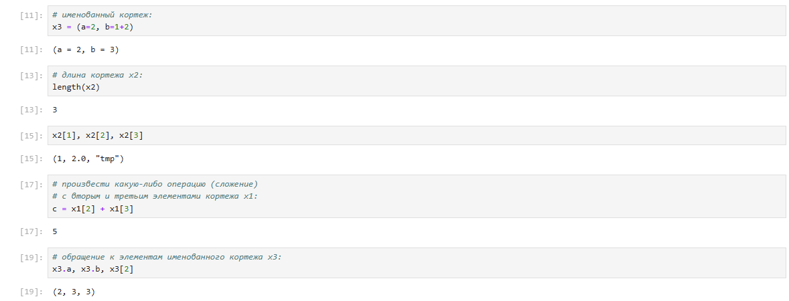{width=50%}

## Примеры со словарями

Выполнила примеры со словарями:

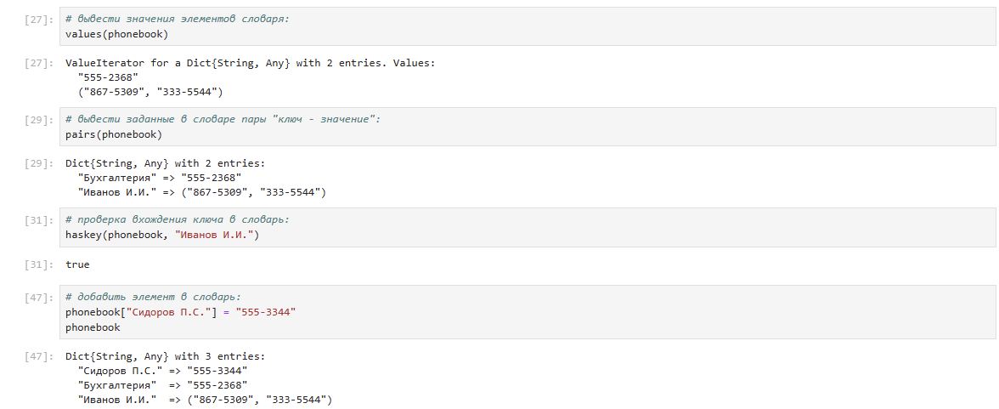{width=50%}

## Примеры со множествами

Выполнила примеры со множествами:

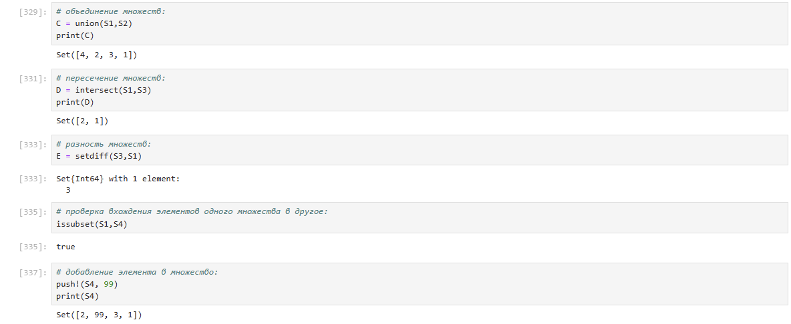{width=50%}

## Примеры с массивами

Выполнила примеры с массивами:

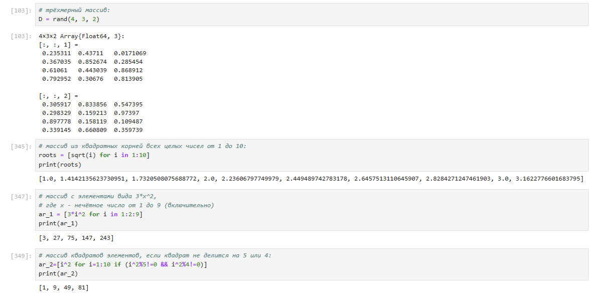{width=40%}

## Задание для самостоятельной работы 1

Выполнила первое задание для самостоятельной работы:

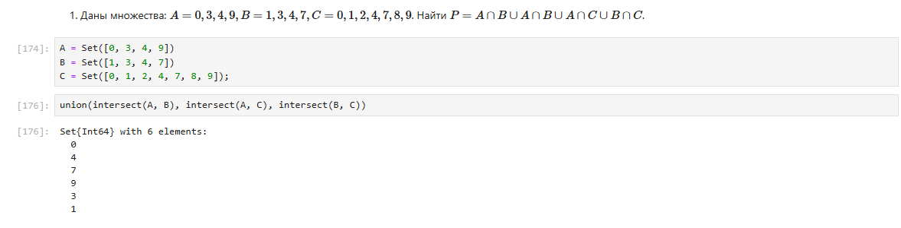{width=70%}

## Задание для самостоятельной работы 2

Выполнила второе задание для самостоятельной работы:

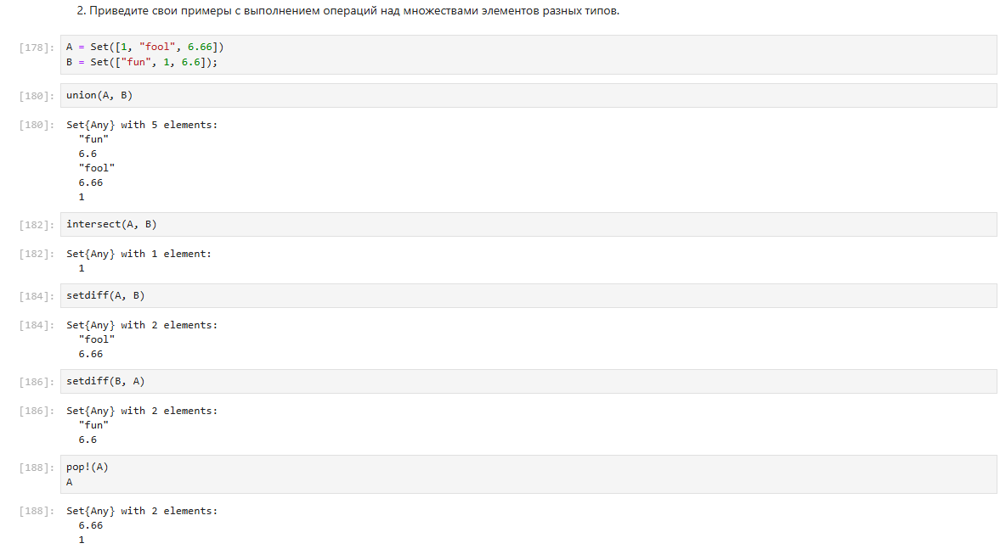{width=30%}

## Задание для самостоятельной работы 3

Выполнила третье задание для самостоятельной работы (пункты 1-8):

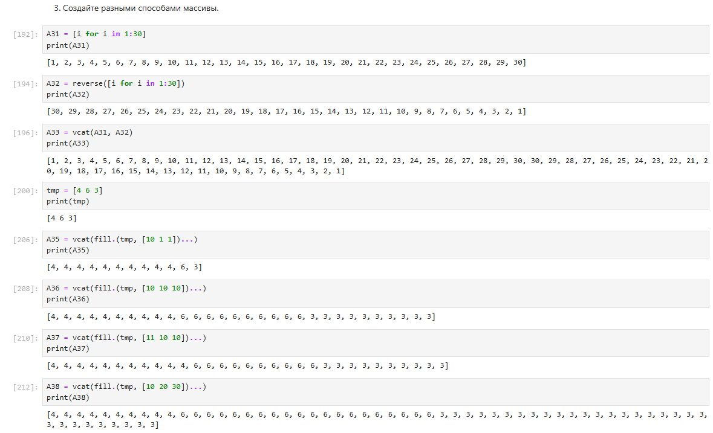{width=30%}

## Задание для самостоятельной работы 3

Выполнила третье задание для самостоятельной работы (пункты 9-11):

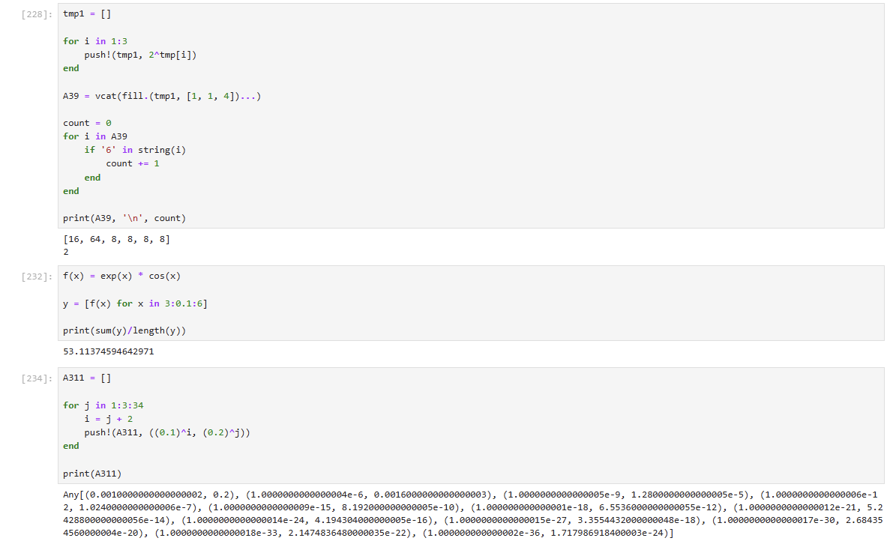{width=30%}

## Задание для самостоятельной работы 3

Выполнила третье задание для самостоятельной работы (пункты 12-13):

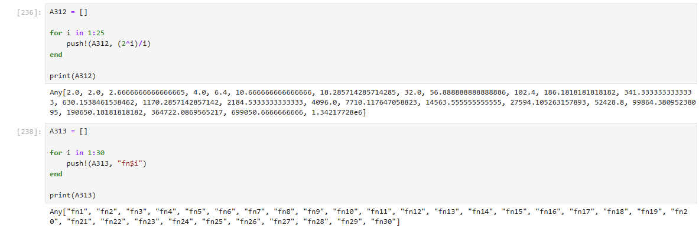{width=50%}

## Задание для самостоятельной работы 3

Выполнила третье задание для самостоятельной работы (пункт 14):

{width=40%}

## Задание для самостоятельной работы 3

Выполнила третье задание для самостоятельной работы (пункты 14.1-2):

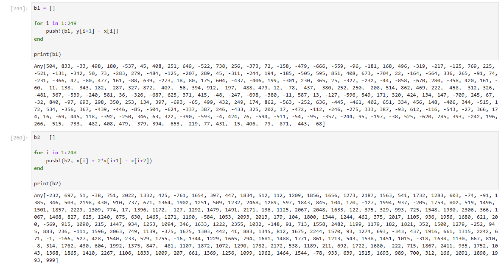{width=30%}

## Задание для самостоятельной работы 3

Выполнила третье задание для самостоятельной работы (пункт 14.3):

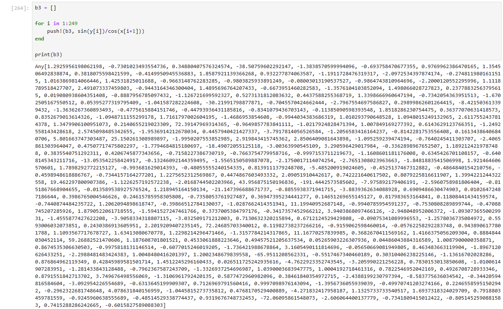{width=30%}

## Задание для самостоятельной работы 3

Выполнила третье задание для самостоятельной работы (пункты 14.4-5):

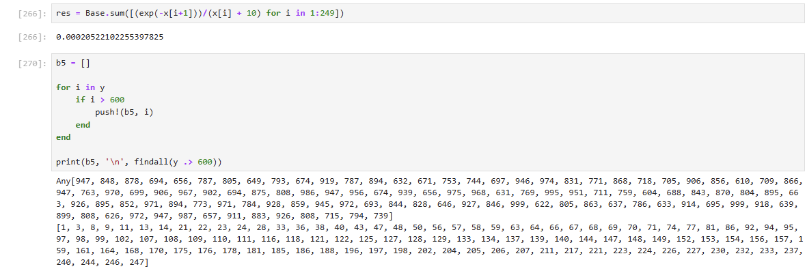{width=50%}

## Задание для самостоятельной работы 3

Выполнила третье задание для самостоятельной работы (пункт 14.6):

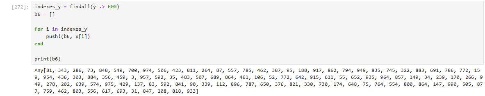{width=70%}

## Задание для самостоятельной работы 3

Выполнила третье задание для самостоятельной работы (пункт 14.7):

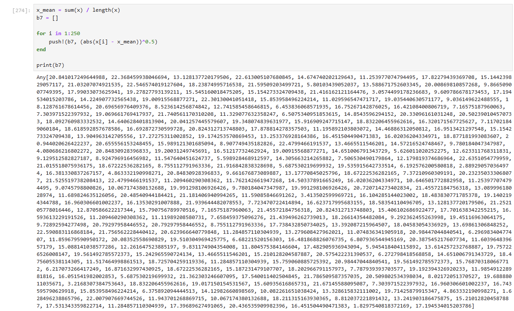{width=30%}

## Задание для самостоятельной работы 3

Выполнила третье задание для самостоятельной работы (пункт 14.8):

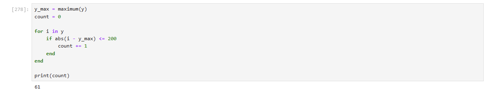{width=70%}

## Задание для самостоятельной работы 3

Выполнила третье задание для самостоятельной работы (пункты 14.9-10):

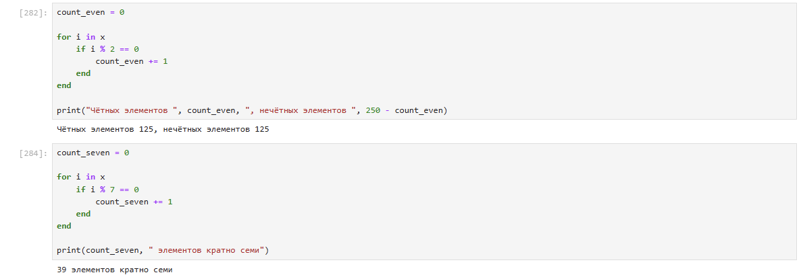{width=50%}

## Задание для самостоятельной работы 3

Выполнила третье задание для самостоятельной работы (пункты 14.11-13):

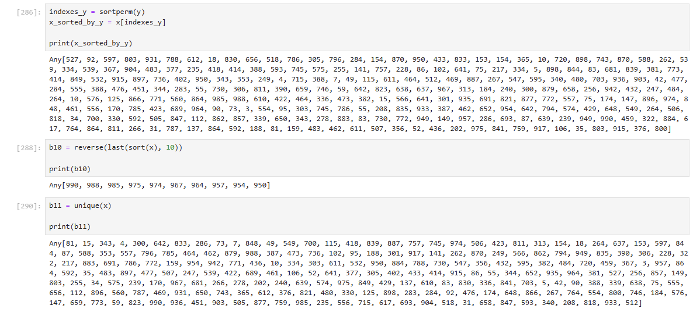{width=50%}

## Задание для самостоятельной работы 4

Выполнила четвёртое задание для самостоятельной работы:

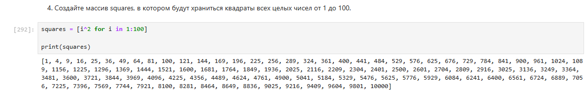{width=80%}

## Задание для самостоятельной работы 5

Выполнила пятое задание для самостоятельной работы:

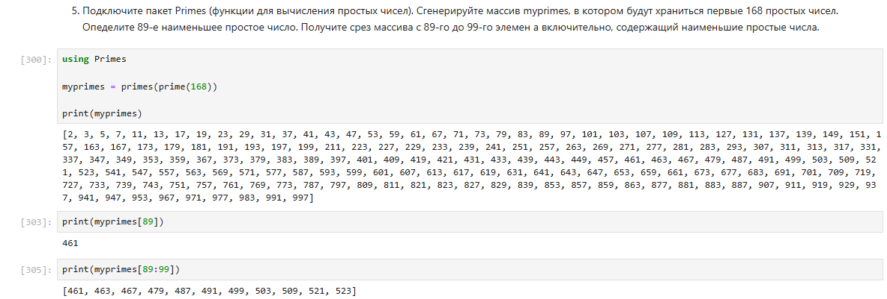{width=50%}

## Задание для самостоятельной работы 6

Выполнила шестое задание для самостоятельной работы:

{width=40%}

# Заключение

## Вывод

Изучила несколько структур данных, реализованных в Julia, научилась применять их и операции над ними для решения задач.