---
## Front matter
lang: ru-RU
title: Лабораторная работа №3
subtitle: Компьютерный практикум по статистическому анализу данных
author:
  - Канева Екатерина, НФИбд-02-22
institute:
  - Российский университет дружбы народов, Москва, Россия
date: 11 октября 2025

## i18n babel
babel-lang: russian
babel-otherlangs: english

## Formatting pdf
toc: false
toc-title: Содержание
slide_level: 2
aspectratio: 169
section-titles: true
theme: metropolis
header-includes:
 - \metroset{progressbar=frametitle,sectionpage=progressbar,numbering=fraction}
---

# Информация

## Докладчик

* Канева Екатерина Павловна
* студент группы НФИбд-02-22
* Российский университет дружбы народов
* [1132222004@rudn.ru](mailto:1132222004@rudn.ru)
* <https://nevseros.github.io/ru/>

# Вводная часть

## Цель работы

Основная цель работы — освоить применение циклов функций и сторонних для Julia пакетов для решения задач линейной алгебры и работы с матрицами.

## Задания

* Используя Jupyter Lab, повторить примеры.
* Выполнить задания для самостоятельной работы.

# Выполнение работы

## Примеры с циклами

Выполнила примеры с циклами:

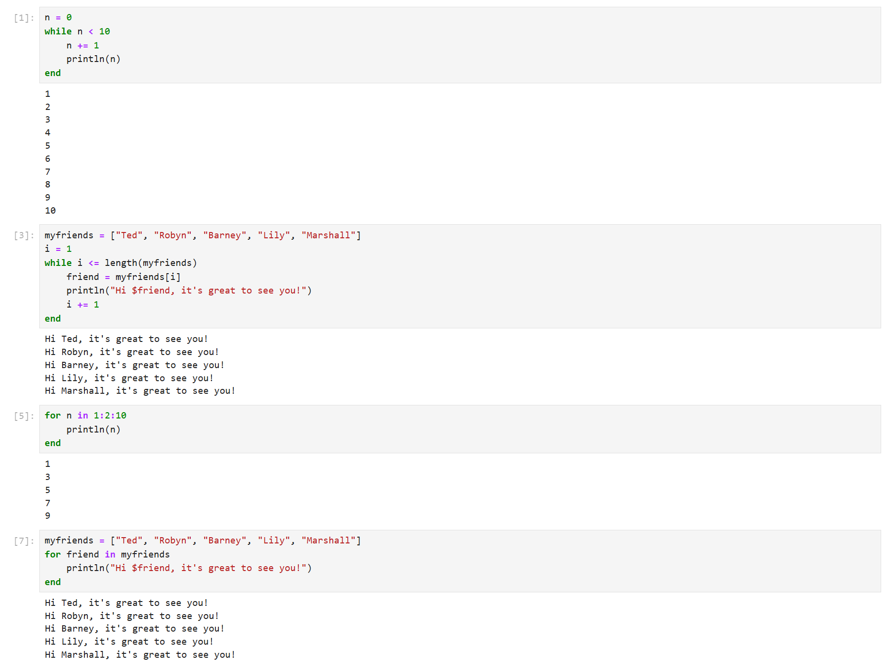{width=40%}

## Примеры с условными выражениями

Выполнила примеры с условными выражениями:

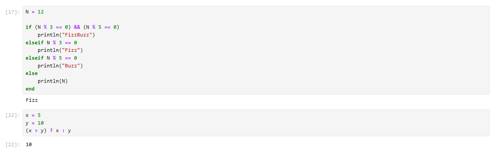{width=60%}

## Примеры с функциями

Выполнила примеры с функциями:

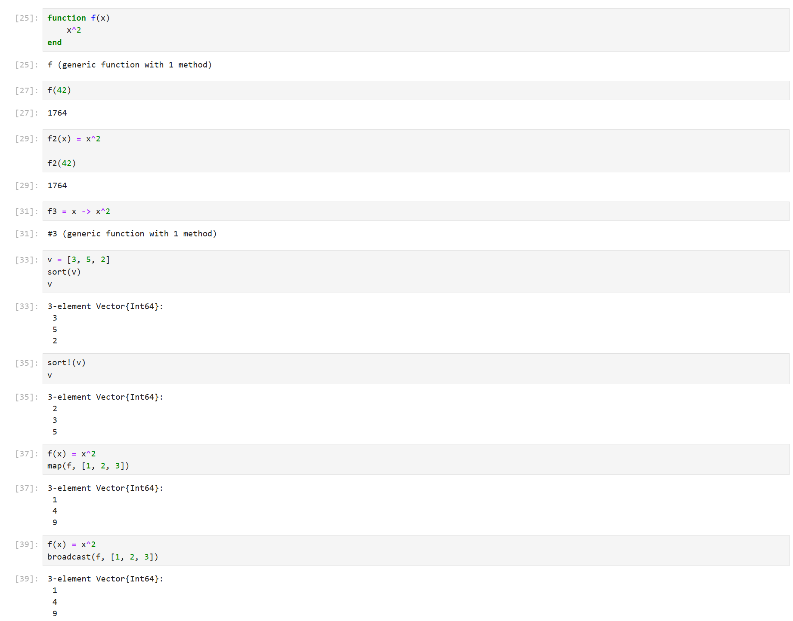{width=40%}

## Примеры со сторонними библиотеками

Выполнила примеры со сторонними библиотекам:

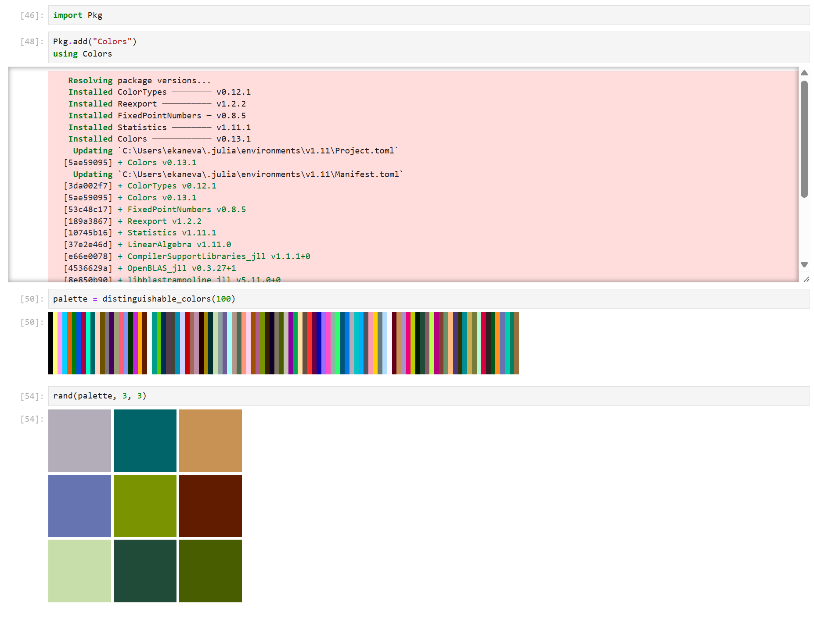{width=40%}

## Задание для самостоятельной работы 1

Выполнила первое задание для самостоятельной работы:

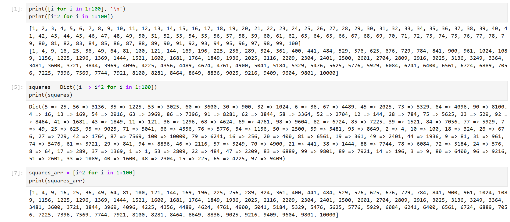{width=70%}

## Задание для самостоятельной работы 2

Выполнила второе задание для самостоятельной работы:

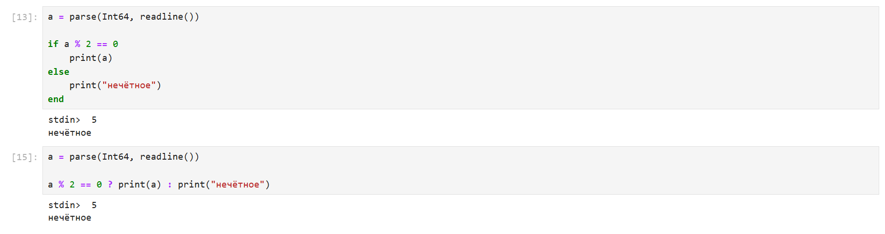{width=60%}

## Задание для самостоятельной работы 3

Выполнила третье задание для самостоятельной работы:

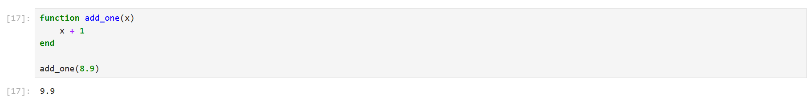{width=60%}

## Задание для самостоятельной работы 4

Выполнила четвёртое задание для самостоятельной работы:

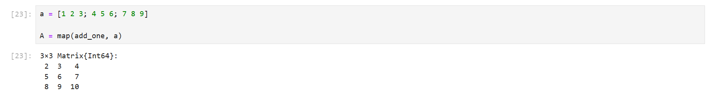{width=80%}

## Задание для самостоятельной работы 5

Выполнила пятое задание для самостоятельной работы:

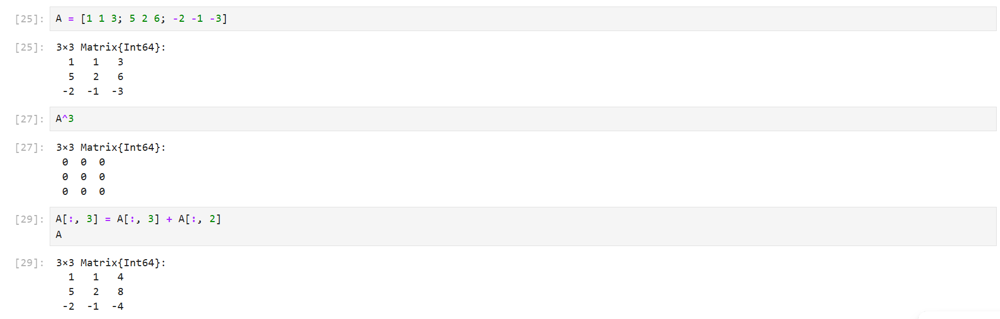{width=60%}

## Задание для самостоятельной работы 6

Выполнила шестое задание для самостоятельной работы:

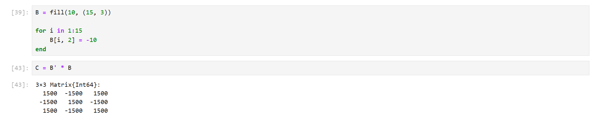{width=60%}

## Задание для самостоятельной работы 7

Выполнила седьмое задание для самостоятельной работы:

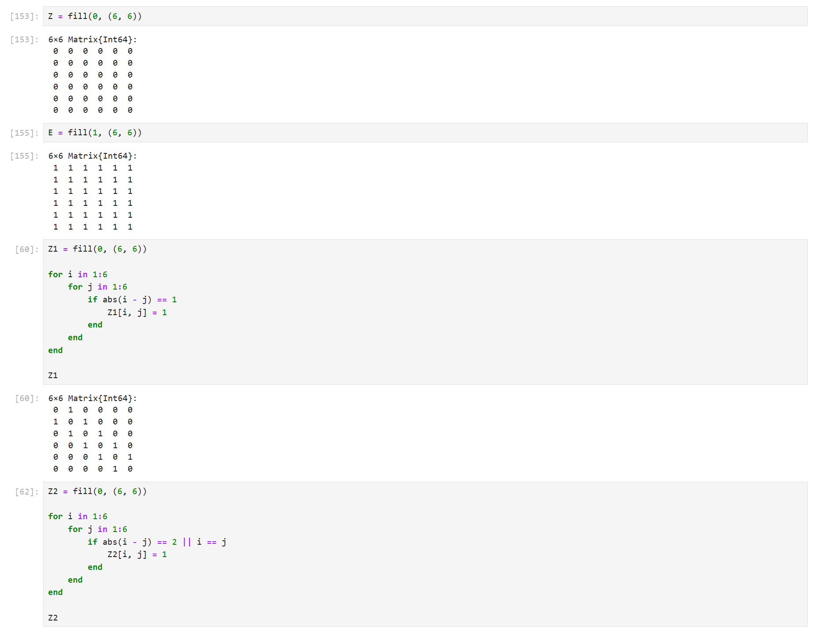{width=40%}

## Задание для самостоятельной работы 7

Выполнила седьмое задание для самостоятельной работы:

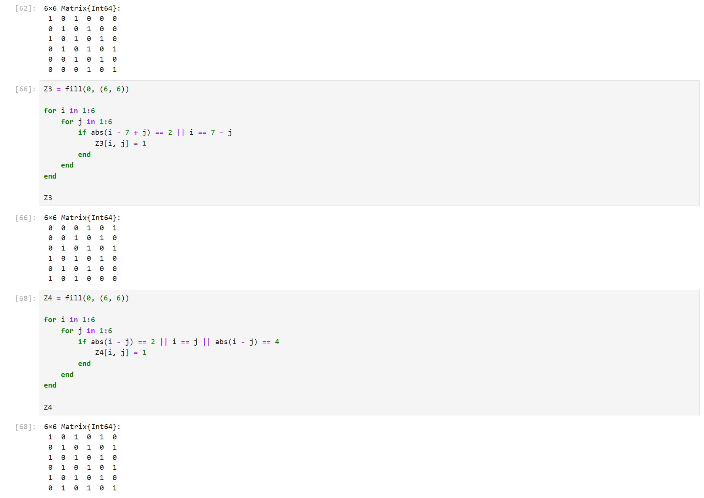{width=40%}

## Задание для самостоятельной работы 8

Выполнила восьмое задание для самостоятельной работы:

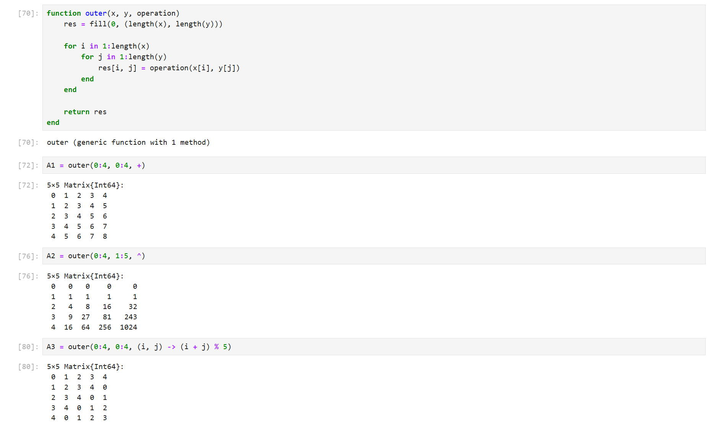{width=60%}

## Задание для самостоятельной работы 8

Выполнила восьмое задание для самостоятельной работы:

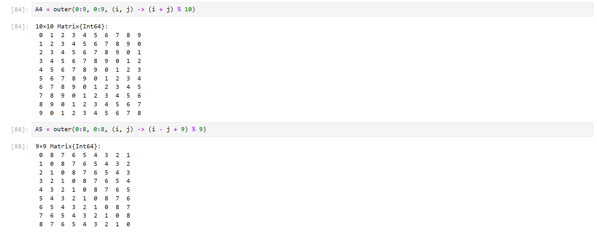{width=60%}

## Задание для самостоятельной работы 9

Выполнила девятое задание для самостоятельной работы:

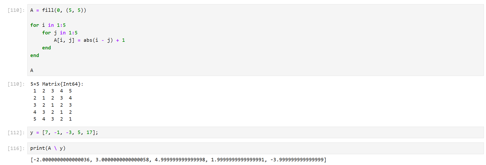{width=60%}

## Задание для самостоятельной работы 10

Выполнила десятое задание для самостоятельной работы:

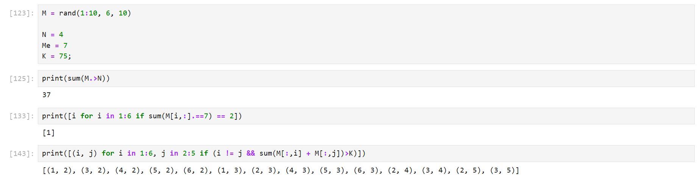{width=60%}

## Задание для самостоятельной работы 11

Выполнила одиннадцатое задание для самостоятельной работы:

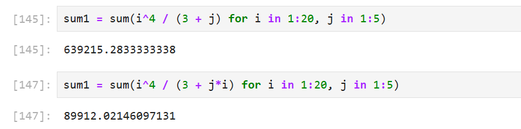{width=60%}

# Заключение

## Вывод

Освоила применение циклов функций и сторонних для Julia пакетов для решения задач линейной алгебры и работы с матрицами.