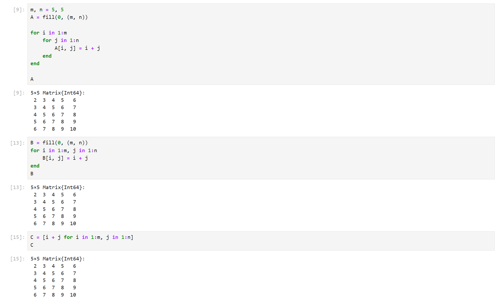
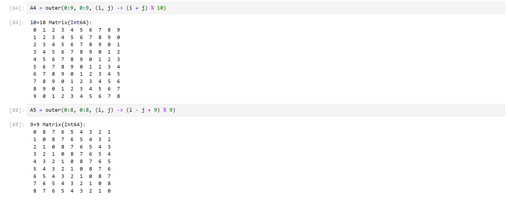
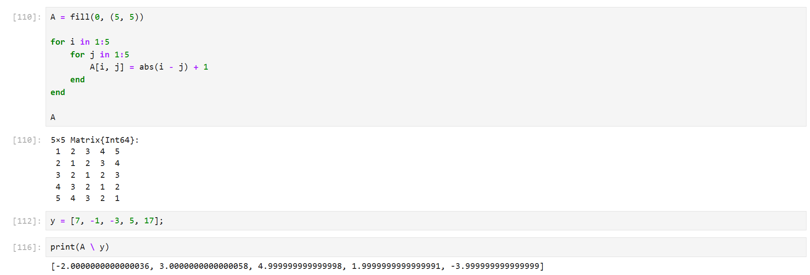
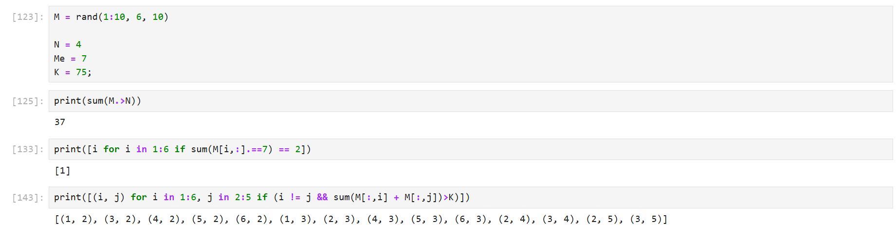
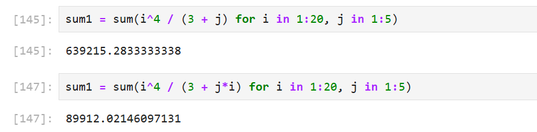

---
## Front matter
title: "Отчёт по лабораторной работе №3"
subtitle: "Компьютерный практикум по статистическому анализу данных"
author: "Канева Екатерина, НФИбд-02-22"

## Generic otions
lang: ru-RU
toc-title: "Содержание"

## Bibliography
bibliography: bib/cite.bib
csl: pandoc/csl/gost-r-7-0-5-2008-numeric.csl

## Pdf output format
toc: true # Table of contents
toc-depth: 2
lof: true # List of figures
lot: true # List of tables
fontsize: 12pt
linestretch: 1.5
papersize: a4
documentclass: scrreprt
## I18n polyglossia
polyglossia-lang:
  name: russian
  options:
  - spelling=modern
  - babelshorthands=true
polyglossia-otherlangs:
  name: english
## I18n babel
babel-lang: russian
babel-otherlangs: english
## Fonts
mainfont: IBM Plex Serif
romanfont: IBM Plex Serif
sansfont: IBM Plex Sans
monofont: IBM Plex Mono
mathfont: STIX Two Math
mainfontoptions: Ligatures=Common,Ligatures=TeX,Scale=0.94
romanfontoptions: Ligatures=Common,Ligatures=TeX,Scale=0.94
sansfontoptions: Ligatures=Common,Ligatures=TeX,Scale=MatchLowercase,Scale=0.94
monofontoptions: Scale=MatchLowercase,Scale=0.94,FakeStretch=0.9
mathfontoptions:
## Biblatex
biblatex: true
biblio-style: "gost-numeric"
biblatexoptions:
  - parentracker=true
  - backend=biber
  - hyperref=auto
  - language=auto
  - autolang=other*
  - citestyle=gost-numeric
## Pandoc-crossref LaTeX customization
figureTitle: "Рис."
tableTitle: "Таблица"
listingTitle: "Листинг"
lofTitle: "Список иллюстраций"
lotTitle: "Список таблиц"
lolTitle: "Листинги"
## Misc options
indent: true
header-includes:
  - \usepackage{indentfirst}
  - \usepackage{float} # keep figures where there are in the text
  - \floatplacement{figure}{H} # keep figures where there are in the text
---

# Цель работы

Основная цель работы — освоить применение циклов функций и сторонних для Julia пакетов для решения задач линейной алгебры и работы с матрицами.

# Задание

* Используя Jupyter Lab, повторить примеры.
* Выполнить задания для самостоятельной работы.

# Теоретическая часть

Julia - высокоуровневый свободный язык программирования с динамической типизацией, созданный для математических вычислений. Эффективен также и для написания программ общего назначения. Синтаксис языка схож с синтаксисом других математических языков, однако имеет некоторые существенные отличия.

Для выполнения заданий была использована официальная документация Julia.

# Выполнение лабораторной работы

Сначала я выполнила примеры с циклами while и for (рис. [-@fig:1], [-@fig:18]):

{#fig:1 width=70%}

{#fig:18 width=70%}

Потом я выполнила примеры с условными выражениями (рис. [-@fig:2]):

{#fig:2 width=70%}

Потом я выполнила примеры с функциями (рис. [-@fig:3]):

{#fig:3 width=70%}

Потом я выполнила примеры со сторонними библиотеками (рис. [-@fig:4]):

{#fig:4 width=70%}

Далее я приступила к выполнению заданий для самостоятельной работы.

1. Используя циклы while и for.

- выведем на экран целые числа от 1 до 100 и напечатаем их квадраты
- создадим словарь squares, который будет содержать целые числа в качестве ключей и квадраты в качестве их пар-значений
- создадим массив squares_arr, содержащий квадраты всех чисел от 1 до 100.

{#fig:5 width=70%}

2. Напишем условный оператор, который печатает число, если число чётное, и строку «нечётное», если число нечётное. Перепишем код, используя тернарный оператор (рис. [-@fig:6]):

{#fig:6 width=70%}

3. Напишем функцию add_one, которая добавляет 1 к своему входу (рис. [-@fig:7]):

{#fig:7 width=70%}

4. Используем map() для задания матрицы A, каждый элемент которой увеличивается на единицу по сравнению с предыдущим. (рис. [-@fig:8]).

{#fig:8 width=70%}

5. Зададим матрицу A. Найдем A^3. Заменим третий столбец матрицы A на сумму второго и третьего столбцов (рис. [-@fig:9]):

{#fig:9 width=70%}

6. Создадим матрицу B с элементами $B_{i1} = 10$, $B_{i2} = -10$, $B_{i3} = 10$, $i = \overline{1, 15}$. Вычислим матрицу $C = B^TB$. (рис. [-@fig:10]).

{#fig:10 width=70%}

7. Создадим матрицу Z размерности 6x6, все элементы которой равны нулю, и матрицу E, все элементы которой равны 1. Используя цикл while или for и закономерности расположения элементов, создадим новые матрицы размерности 6x6 (рис. [-@fig:11]-[-@fig:12]):

{#fig:11 width=70%}

{#fig:12 width=70%}

8. В языке R есть функция outer(). Напишем свою функцию, аналогичную функции outer() языка R. Функция будет иметь следующий интерфейс: outer(x,y,operation). Используя написанную функцию outer(), создадим новые матрицы (рис. [-@fig:13]-[-@fig:14]):

{#fig:13 width=70%}

{#fig:14 width=70%}

9. Решим систему линейных уравнений с 5 неизвестными, рассмотрев соответствующее матричное уравнение $Ax = y$ (рис. [-@fig:9]):

{#fig:15 width=70%}

10. Создадим матрицу M размерности 6x10, элементами которой являются целые числа, выбранные случайным образом с повторениями из совокупности 1-10. Найдём число элементов в каждой строке матрицы M, которые больше числа N (например, N = 4), определим, в каких строках матрицы M число M (например, M = 7) встречается ровно 2 раза, определим все пары столбцов матрицы M, сумма элементов которых больше K (например, K = 75) (рис. [-@fig:9]):

{#fig:16 width=70%}

11. Вычислим суммы  (рис. [-@fig:9]):

{#fig:17 width=70%}

# Выводы

Освоила применение циклов функций и сторонних для Julia пакетов для решения задач линейной алгебры и работы с матрицами.