---
## Front matter
title: "Отчёт по лабораторной работе №1"
subtitle: "Математическое моделирование"
author: "Канева Екатерина, НФИбд-02-22"

## Generic otions
lang: ru-RU
toc-title: "Содержание"

## Bibliography
bibliography: bib/cite.bib
csl: pandoc/csl/gost-r-7-0-5-2008-numeric.csl

## Pdf output format
toc: true # Table of contents
toc-depth: 2
lof: true # List of figures
lot: true # List of tables
fontsize: 12pt
linestretch: 1.5
papersize: a4
documentclass: scrreprt
## I18n polyglossia
polyglossia-lang:
  name: russian
  options:
	- spelling=modern
	- babelshorthands=true
polyglossia-otherlangs:
  name: english
## I18n babel
babel-lang: russian
babel-otherlangs: english
## Fonts
mainfont: IBM Plex Serif
romanfont: IBM Plex Serif
sansfont: IBM Plex Sans
monofont: IBM Plex Mono
mathfont: STIX Two Math
mainfontoptions: Ligatures=Common,Ligatures=TeX,Scale=0.94
romanfontoptions: Ligatures=Common,Ligatures=TeX,Scale=0.94
sansfontoptions: Ligatures=Common,Ligatures=TeX,Scale=MatchLowercase,Scale=0.94
monofontoptions: Scale=MatchLowercase,Scale=0.94,FakeStretch=0.9
mathfontoptions:
## Biblatex
biblatex: true
biblio-style: "gost-numeric"
biblatexoptions:
  - parentracker=true
  - backend=biber
  - hyperref=auto
  - language=auto
  - autolang=other*
  - citestyle=gost-numeric
## Pandoc-crossref LaTeX customization
figureTitle: "Рис."
tableTitle: "Таблица"
listingTitle: "Листинг"
lofTitle: "Список иллюстраций"
lotTitle: "Список таблиц"
lolTitle: "Листинги"
## Misc options
indent: true
header-includes:
  - \usepackage{indentfirst}
  - \usepackage{float} # keep figures where there are in the text
  - \floatplacement{figure}{H} # keep figures where there are in the text
---

# Цель работы

Ознакомиться с системой контроля версий (VCS) Git, научиться работать с файлами типа Markdown.

# Задание

* Создать и настроить репозиторий для выполнения лабораторных работ
* Подготовить отчёт и презентацию в формате Markdown

# Теоретическое введение

 Система контроля версий — это система, записывающая изменения в файл или набор файлов в течение времени и позволяющая вернуться позже к определённой версии.

 Markdown — это облегчённый язык разметки для форматирования текстовых документов.

# Выполнение лабораторной работы

Сначала я создала каталог, в который будет помещён репозиторий (рис. [-@fig:1]):

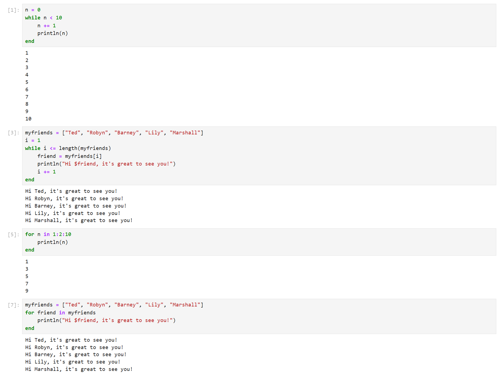{#fig:1 width=70%}

Далее я создала репозиторий на GitHub с помощью шаблона (рис. [-@fig:2]):

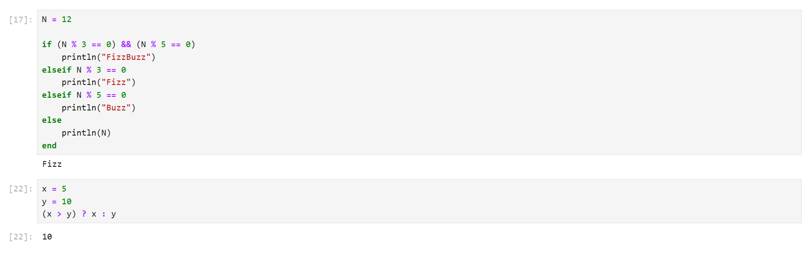{#fig:2 width=70%}

Создала (клонировала) репозиторий локально (рис. [-@fig:3]):

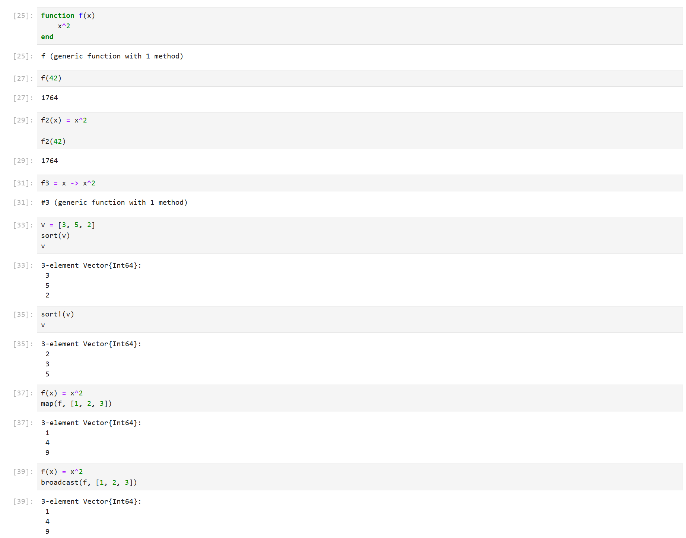{#fig:3 width=70%}

Проверила, что всё правильно создалось (рис. [-@fig:4]):

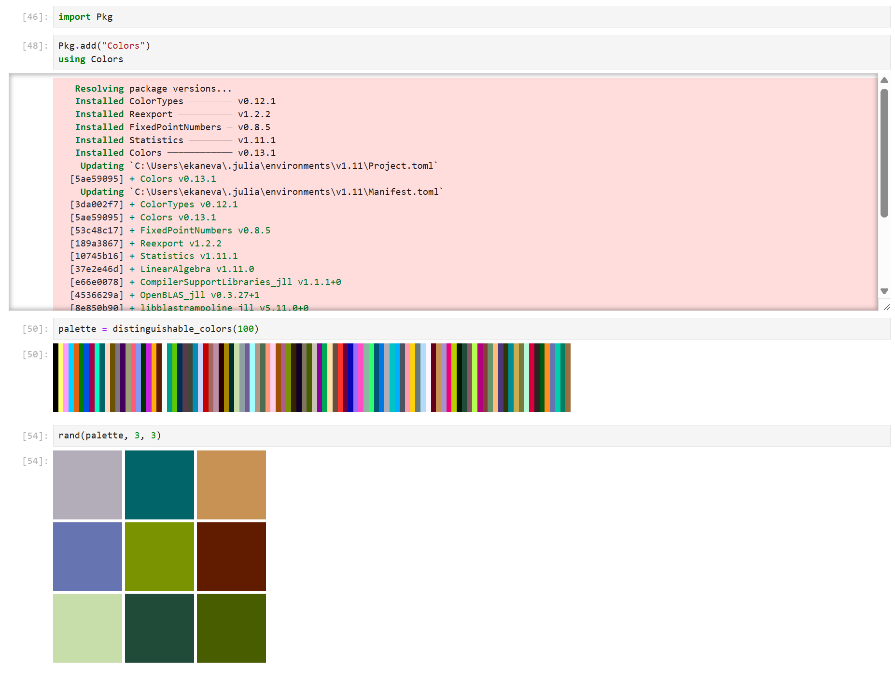{#fig:4 width=70%}

Далее я подготовила репозиторий для нужного курса, для этого ввела команды (рис. [-@fig:5]):

```bash
rm package.json
echo mathmod > COURSE
mingw32-make prepare
```

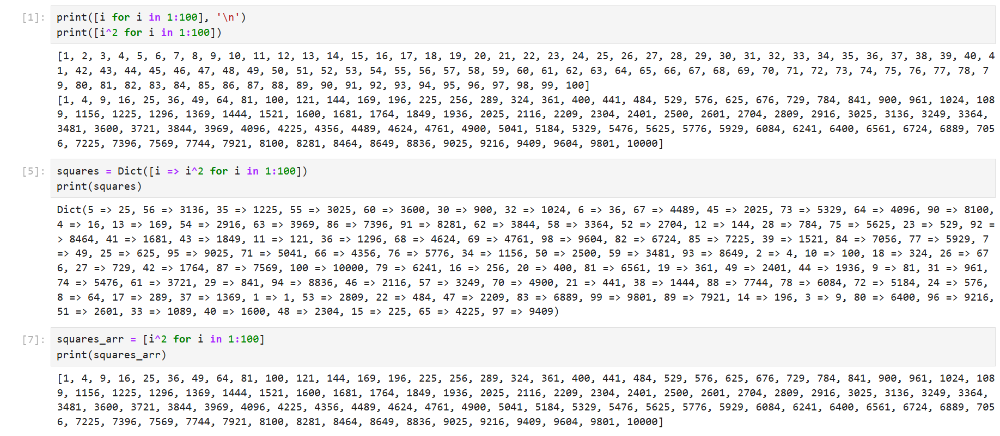{#fig:5 width=70%}

Была использована команда `mingw32-make` вместо `make`, поскольку в моей версии mingw команда `make` поддерживается только в таком виде. Далее Я проверила, что всё правильно создалось и добавила изменения с помощью команды `git add .` (рис. [-@fig:6]):

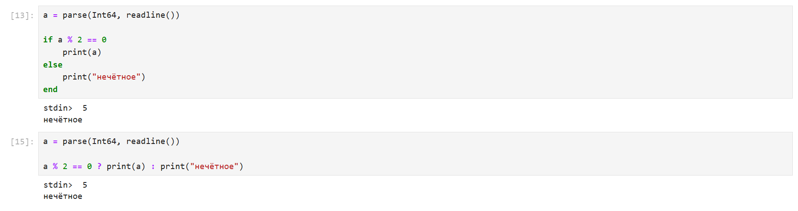{#fig:6 width=70%}

Далее я создала коммит с помощью команды `git commit -m "feat(main): make course structure"` (рис. [-@fig:7]):

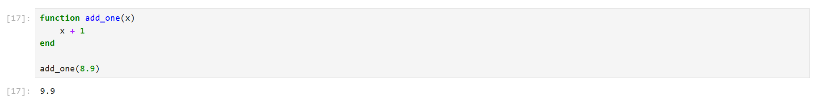{#fig:7 width=70%}

Отправила изменения на удалённый сервер с помощью команды `git push` (рис. [-@fig:8]):

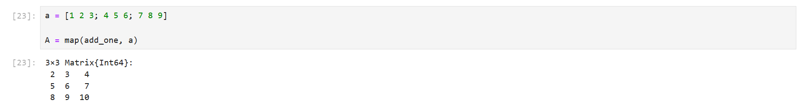{#fig:8 width=70%}

Проверила, что всё дошло (рис. [-@fig:9]):

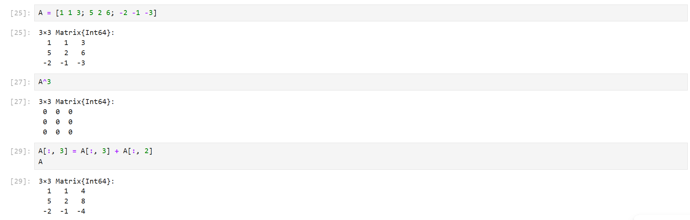{#fig:9 width=70%}

Далее я стала составлять отчёт в формате md, начиная с титульной страницы (рис. [-@fig:10]):

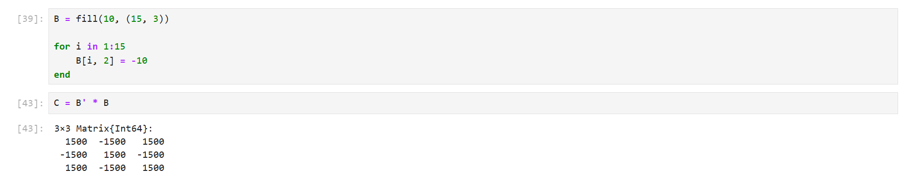{#fig:10 width=70%}

Добавила картинки, описывая выполнение работы (рис. [-@fig:11]):

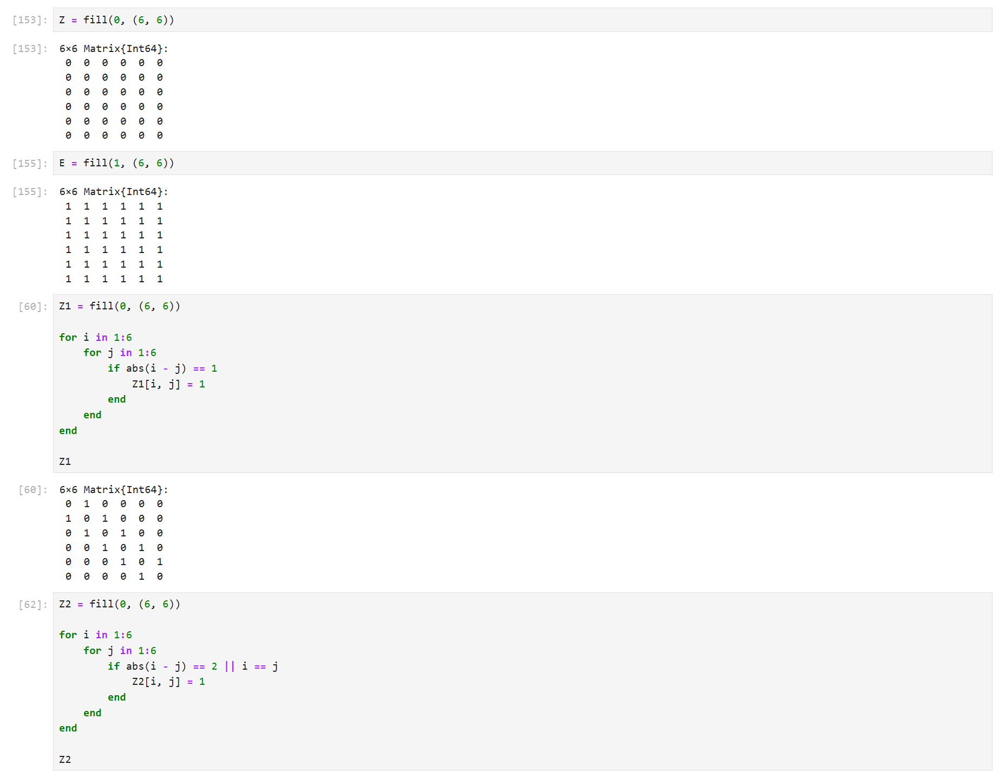{#fig:11 width=70%}

Также добавила части с кодом (рис. [-@fig:12]):

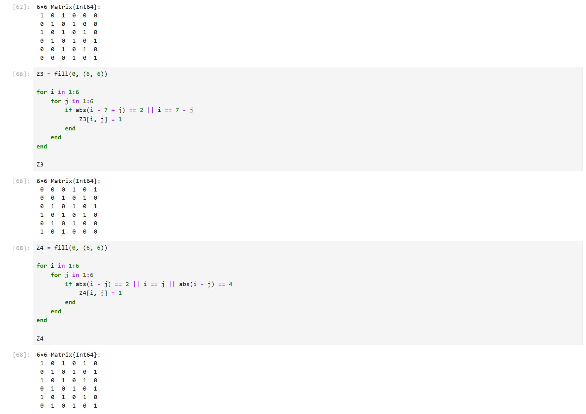{#fig:12 width=70%}

Описала вывод (рис. [-@fig:13]):

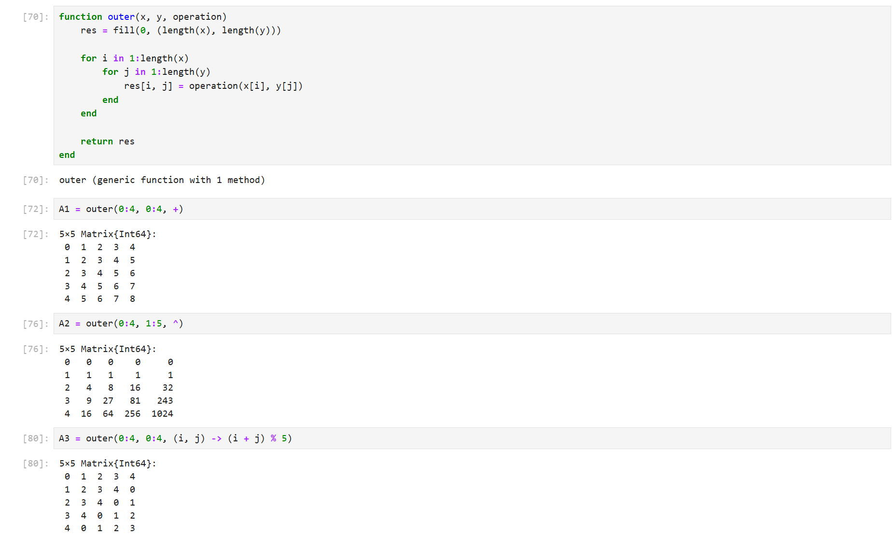{#fig:13 width=70%}

# Выводы

Ознакомилась с системой контроля версий (VCS) Git, научилась работать с файлами типа Markdown.