---
## Front matter
lang: ru-RU
title: Лабораторная работа №4
subtitle: Компьютерный практикум по статистическому анализу данных
author:
  - Канева Екатерина, НФИбд-02-22
institute:
  - Российский университет дружбы народов, Москва, Россия
date: 25 октября 2025

## i18n babel
babel-lang: russian
babel-otherlangs: english

## Formatting pdf
toc: false
toc-title: Содержание
slide_level: 2
aspectratio: 169
section-titles: true
theme: metropolis
header-includes:
 - \metroset{progressbar=frametitle,sectionpage=progressbar,numbering=fraction}
---

# Информация

## Докладчик

* Канева Екатерина Павловна
* студент группы НФИбд-02-22
* Российский университет дружбы народов
* [1132222004@rudn.ru](mailto:1132222004@rudn.ru)
* <https://nevseros.github.io/ru/>

# Вводная часть

## Цель работы

Основной целью работы является изучение возможностей специализированных пакетов Julia для выполнения и оценки эффективности операций над объектами линейной алгебры.

## Задания

* Используя Jupyter Lab, повторить примеры.
* Выполнить задания для самостоятельной работы.

# Выполнение работы

# Примеры

## Примеры с поэлементными операциями

Выполнила примеры с поэлементными операциями:

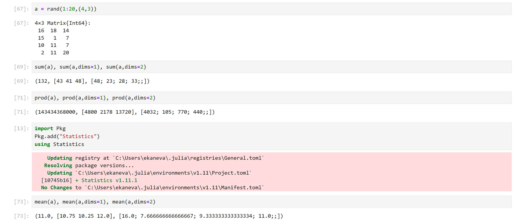{width=80%}

## Примеры из второго раздела

Выполнила примеры с транспонированием, следом, рангом, определителем и инверсией матрицы:

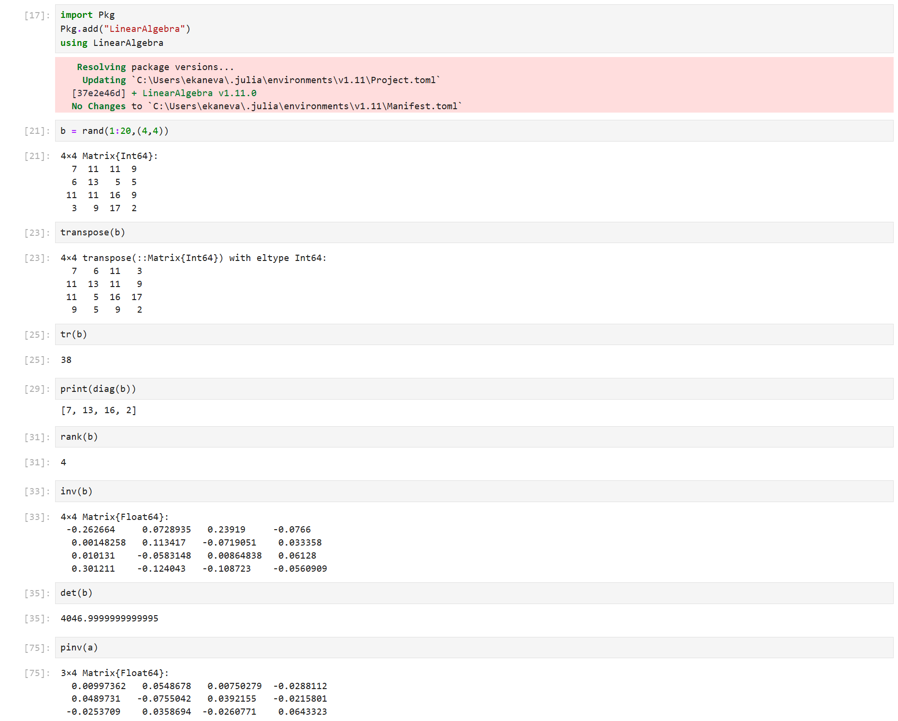{width=40%}

## Примеры из третьего раздела

Выполнила примеры с вычислением нормы векторов и матриц, поворотами, вращениями:

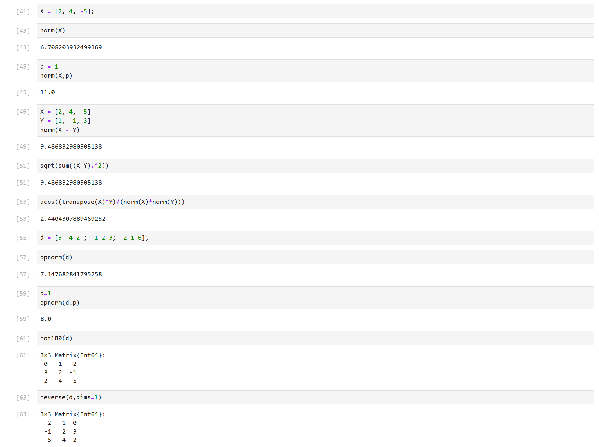{width=40%}

## Примеры из четвёртого раздела

Выполнила примеры с матричным умножением, единичной матрицей, скалярным произведением:

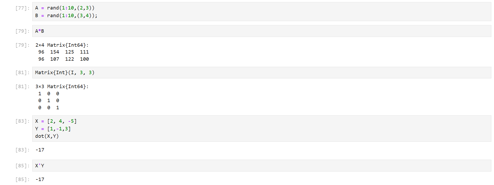{width=80%}

## Примеры из пятого раздела

Выполнила примеры с факторизацией, специальными матричными структурами:

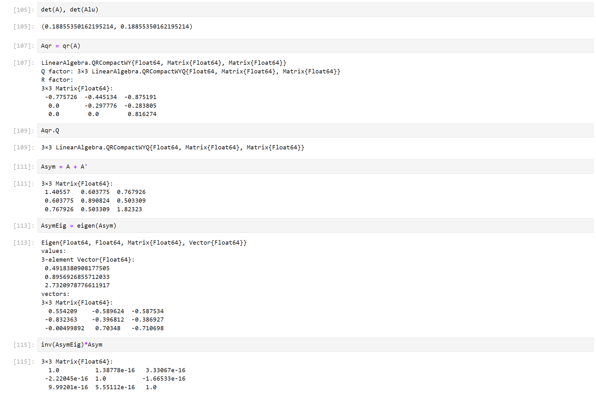{width=60%}

## Примеры из шестого раздела

Выполнила примеры по общей линейной алгебре:

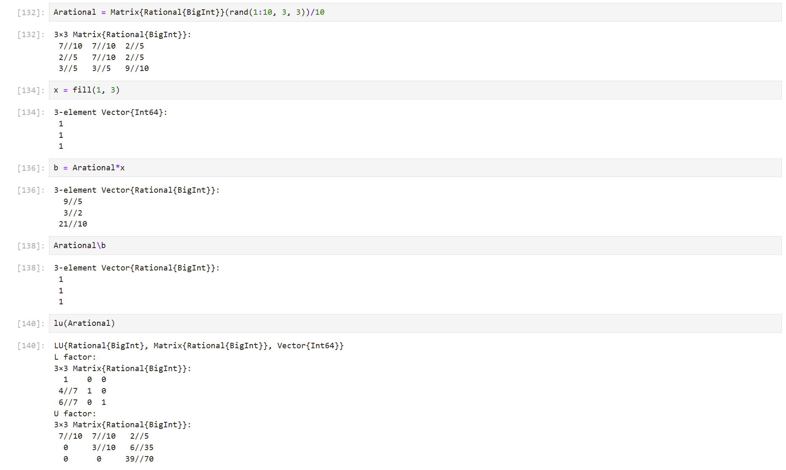{width=50%}

# Задания для самостоятельного выполнения

## Раздел 1

Выполнила первое и второе задания для самостоятельной работы:

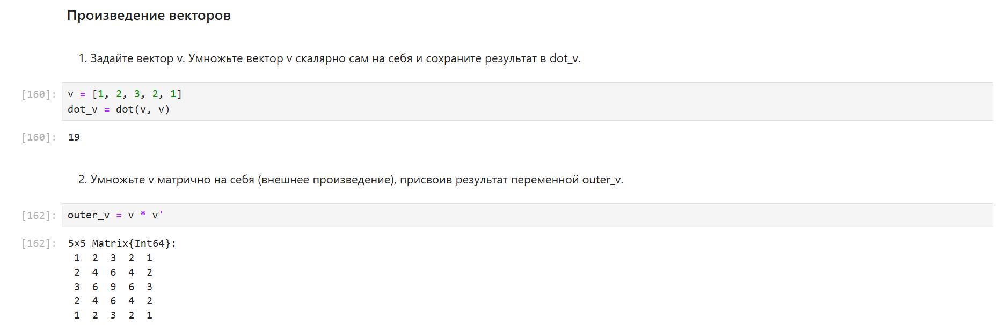{width=80%}

## Раздел 2

Выполнила первое задание для самостоятельной работы:

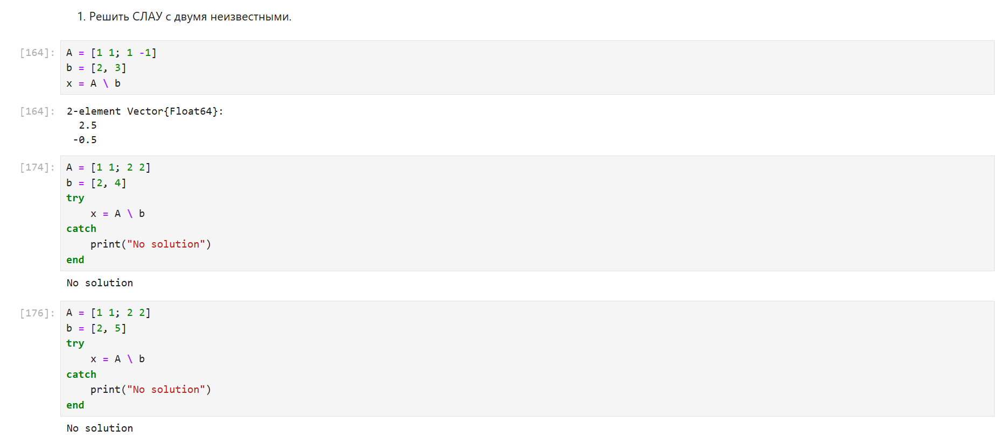{width=80%}

## Раздел 2

Выполнила второе задание для самостоятельной работы:

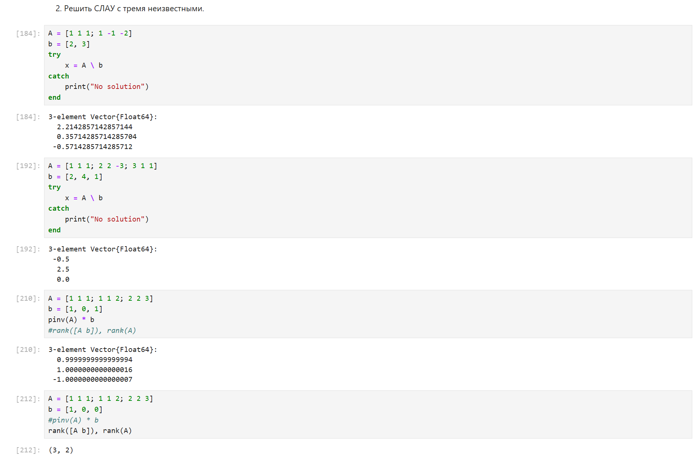{width=50%}

## Раздел 3

Выполнила первое задание для самостоятельной работы:

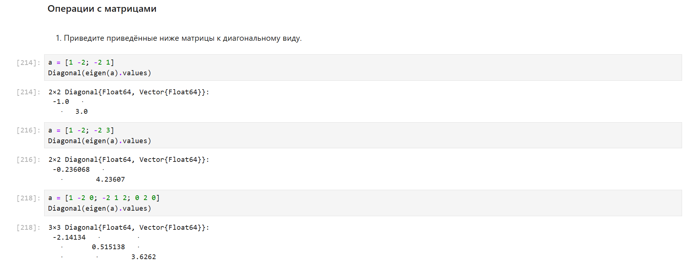{width=80%}

## Раздел 3

Выполнила второе задание для самостоятельной работы:

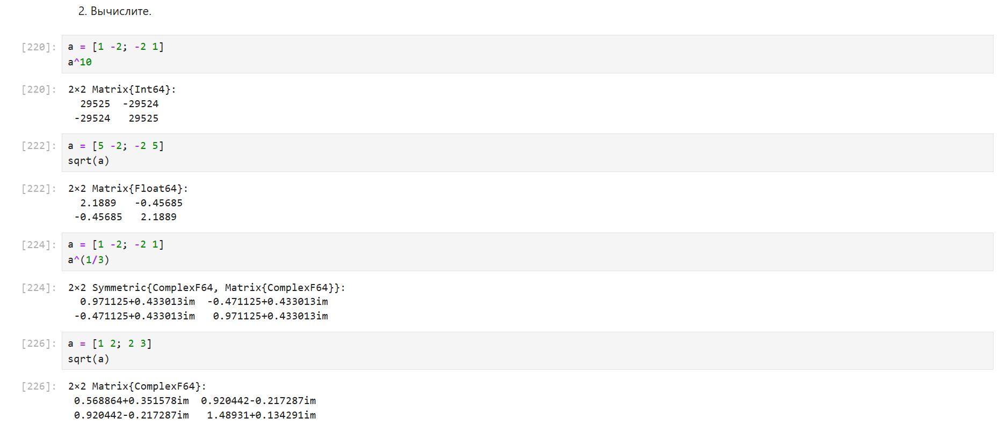{width=80%}

## Раздел 3

Выполнила третье задание для самостоятельной работы:

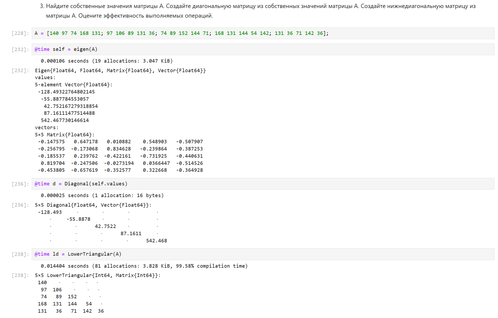{width=50%}

## Раздел 4

Выполнила первое задание для самостоятельной работы:

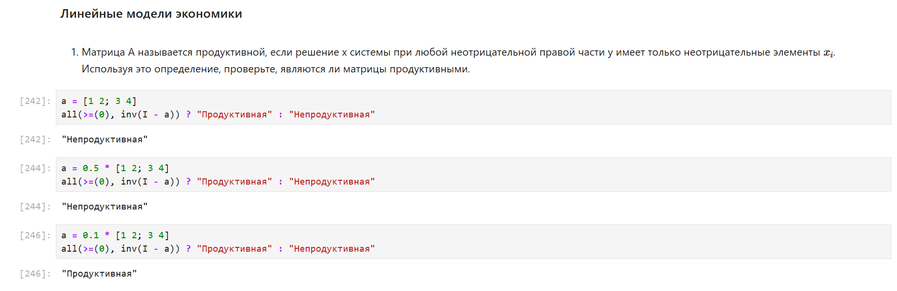{width=80%}

## Раздел 4

Выполнила второе задание для самостоятельной работы:

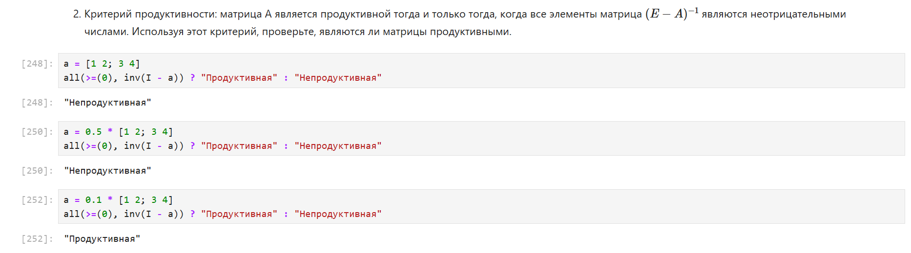{width=80%}

## Раздел 4

Выполнила третье задание для самостоятельной работы:

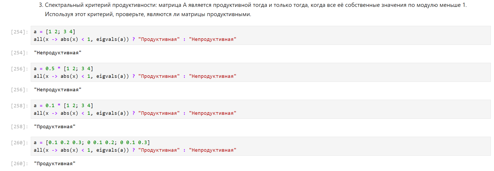{width=80%}

# Заключение

## Вывод

Изучила возможности специализированных пакетов Julia для выполнения и оценки эффективности операций над объектами линейной алгебры.