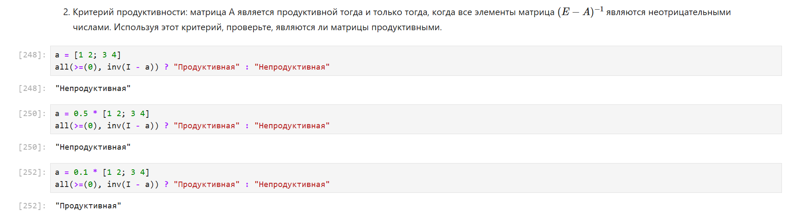

---
## Front matter
title: "Отчёт по лабораторной работе №4"
subtitle: "Компьютерный практикум по статистическому анализу данных"
author: "Канева Екатерина, НФИбд-02-22"

## Generic otions
lang: ru-RU
toc-title: "Содержание"

## Bibliography
bibliography: bib/cite.bib
csl: pandoc/csl/gost-r-7-0-5-2008-numeric.csl

## Pdf output format
toc: true # Table of contents
toc-depth: 2
lof: true # List of figures
lot: true # List of tables
fontsize: 12pt
linestretch: 1.5
papersize: a4
documentclass: scrreprt
## I18n polyglossia
polyglossia-lang:
  name: russian
  options:
  - spelling=modern
  - babelshorthands=true
polyglossia-otherlangs:
  name: english
## I18n babel
babel-lang: russian
babel-otherlangs: english
## Fonts
mainfont: IBM Plex Serif
romanfont: IBM Plex Serif
sansfont: IBM Plex Sans
monofont: IBM Plex Mono
mathfont: STIX Two Math
mainfontoptions: Ligatures=Common,Ligatures=TeX,Scale=0.94
romanfontoptions: Ligatures=Common,Ligatures=TeX,Scale=0.94
sansfontoptions: Ligatures=Common,Ligatures=TeX,Scale=MatchLowercase,Scale=0.94
monofontoptions: Scale=MatchLowercase,Scale=0.94,FakeStretch=0.9
mathfontoptions:
## Biblatex
biblatex: true
biblio-style: "gost-numeric"
biblatexoptions:
  - parentracker=true
  - backend=biber
  - hyperref=auto
  - language=auto
  - autolang=other*
  - citestyle=gost-numeric
## Pandoc-crossref LaTeX customization
figureTitle: "Рис."
tableTitle: "Таблица"
listingTitle: "Листинг"
lofTitle: "Список иллюстраций"
lotTitle: "Список таблиц"
lolTitle: "Листинги"
## Misc options
indent: true
header-includes:
  - \usepackage{indentfirst}
  - \usepackage{float} # keep figures where there are in the text
  - \floatplacement{figure}{H} # keep figures where there are in the text
---

# Цель работы

Основной целью работы является изучение возможностей специализированных пакетов Julia для выполнения и оценки эффективности операций над объектами линейной алгебры.

# Задание

* Используя Jupyter Lab, повторить примеры.
* Выполнить задания для самостоятельной работы.

# Теоретическая часть

Julia - высокоуровневый свободный язык программирования с динамической типизацией, созданный для математических вычислений. Эффективен также и для написания программ общего назначения. Синтаксис языка схож с синтаксисом других математических языков, однако имеет некоторые существенные отличия.

Для выполнения заданий была использована официальная документация Julia.

# Выполнение лабораторной работы

## Примеры

Сначала я выполнила примеры с поэлементными операциями над многомерными массивами (рис. [-@fig:1]):

{#fig:1 width=90%}

Потом я выполнила примеры с транспонированием, следом, рангом, определителем и инверсией матрицы (рис. [-@fig:2]):

{#fig:2 width=90%}

Потом я выполнила примеры с вычислением нормы векторов и матриц, поворотами, вращениями (рис. [-@fig:3]):

{#fig:3 width=90%}

Потом я выполнила примеры с матричным умножением, единичной матрицей, скалярным произведением (рис. [-@fig:4]):

{#fig:4 width=90%}

Потом я выполнила примеры с факторизацией, специальными матричными структурами (рис. [-@fig:5]-[-@fig:7]):

{#fig:5 width=90%}

{#fig:6 width=90%}

{#fig:7 width=90%}

Потом я выполнила примеры по общей линейной алгебре (рис. [-@fig:8]):

{#fig:8 width=90%}

## Задания для самостоятельной работы

Далее я приступила к выполнению заданий для самостоятельной работы.

### Произведение векторов

Выполнила следующие задания (рис. [-@fig:9]):

1. Задайте вектор v. Умножьте вектор v скалярно сам на себя и сохраните результат в dot_v.
2. Умножьте v матрично на себя (внешнее произведение), присвоив результат переменной outer_v.

{#fig:9 width=90%}

### Системы линейных уравнений

Выполнила следующие задания:

1. Решить СЛАУ с двумя неизвестными (рис. [-@fig:10]-[-@fig:11]):

{#fig:10 width=90%}

{#fig:11 width=90%}

2. Решить СЛАУ с двумя неизвестными (рис. [-@fig:12]):

{#fig:12 width=90%}

### Операции с матрицами

Выполнила следующие задания:

1. Приведите приведённые ниже матрицы к диагональному виду (рис. [-@fig:13]).

{#fig:13 width=90%}

2. Вычислите (рис. [-@fig:14]):

{#fig:14 width=90%}

3. Найдите собственные значения матрицы A. Создайте диагональную матрицу из собственных значений матрицы A. Создайте нижнедиагональную матрицу из матрицы A. Оцените эффективность выполняемых операций (рис. [-@fig:15]).

{#fig:15 width=90%}

### Линейные модели экономики

1. Матрица A называется продуктивной, если решение x системы при любой неотрицательной правой части y имеет только неотрицательные элементы $x_i$. Используя это определение, проверьте, являются ли матрицы продуктивными (рис. [-@fig:16]):

{#fig:16 width=90%}

2. Критерий продуктивности: матрица A является продуктивной тогда и только тогда, когда все элементы матрица $(E - A)^{-1}$ являются неотрицательными числами. Используя этот критерий, проверьте, являются ли матрицы продуктивными (рис. [-@fig:17]):

{#fig:17 width=90%}

3. Спектральный критерий продуктивности: матрица A является продуктивной тогда и только тогда, когда все её собственные значения по модулю меньше 1. Используя этот критерий, проверьте, являются ли матрицы продуктивными (рис. [-@fig:18]):

{#fig:18 width=90%}

# Выводы

Изучила возможности специализированных пакетов Julia для выполнения и оценки эффективности операций над объектами линейной алгебры.