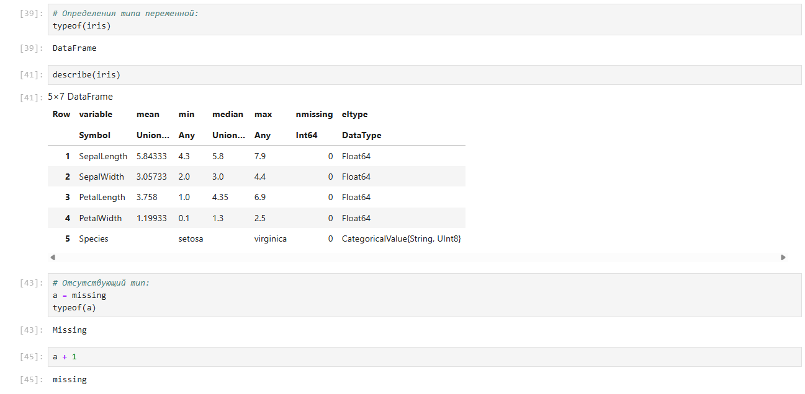
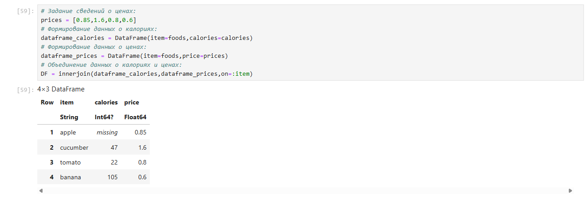
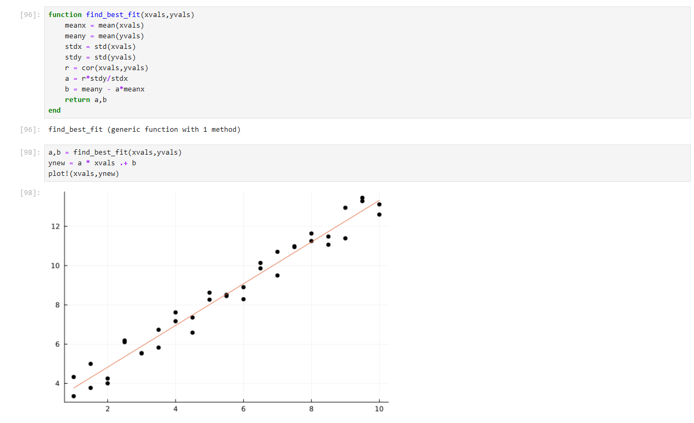
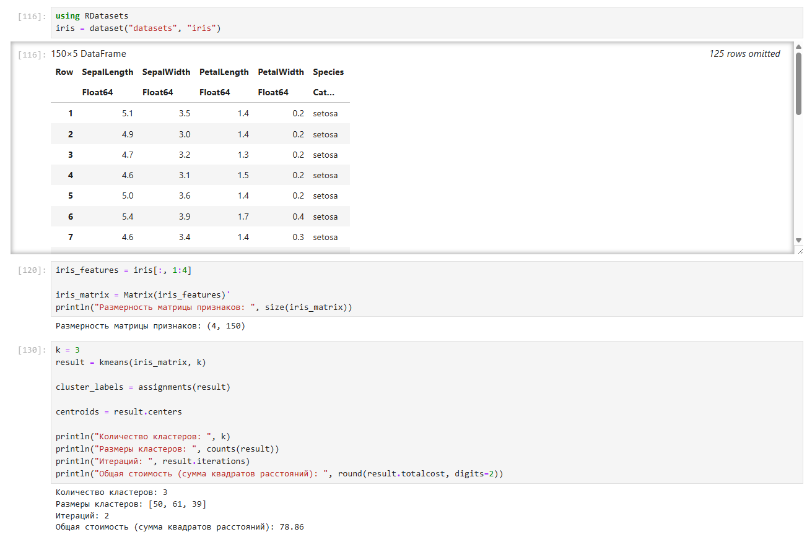
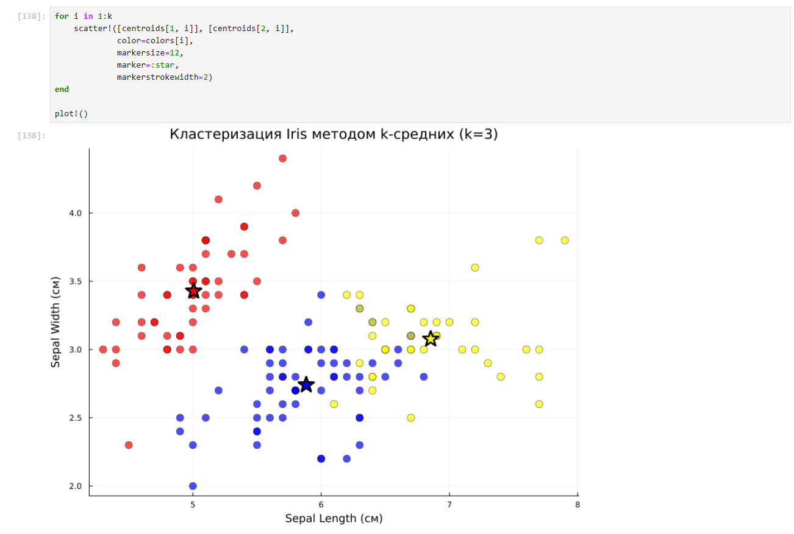
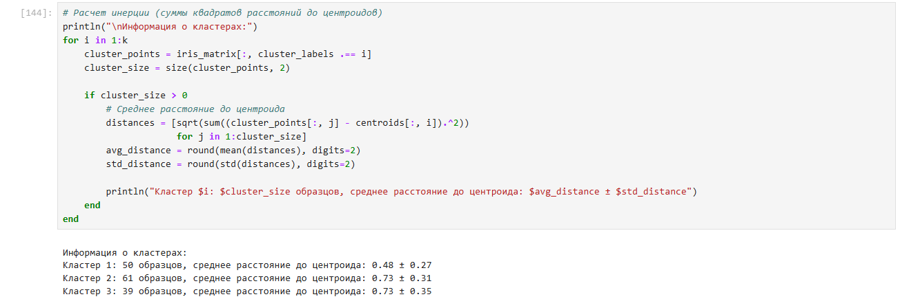
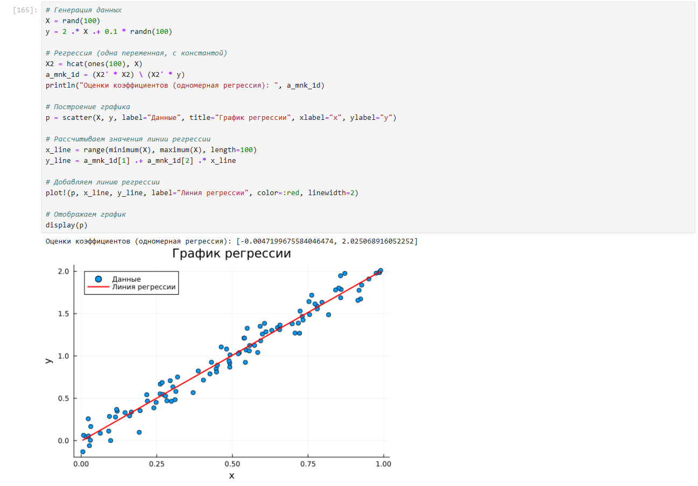

---
## Front matter
lang: ru-RU
title: Лабораторная работа №7
subtitle: Компьютерный практикум по статистическому анализу данных
author:
  - Канева Екатерина, НФИбд-02-22
institute:
  - Российский университет дружбы народов, Москва, Россия
date: 6 декабря 2025

## i18n babel
babel-lang: russian
babel-otherlangs: english

## Formatting pdf
toc: false
toc-title: Содержание
slide_level: 2
aspectratio: 169
section-titles: true
theme: metropolis
header-includes:
 - \metroset{progressbar=frametitle,sectionpage=progressbar,numbering=fraction}
---

# Информация

## Докладчик

* Канева Екатерина Павловна
* студент группы НФИбд-02-22
* Российский университет дружбы народов
* [1132222004@rudn.ru](mailto:1132222004@rudn.ru)
* <https://nevseros.github.io/ru/>

# Вводная часть

## Цель работы

Основной целью работы является освоение специализированных пакетов Julia для обработки данных.

## Задания

* Используя Jupyter Lab, повторить примеры.
* Выполнить задания для самостоятельной работы.

# Выполнение работы

# Примеры

## Примеры со считыванием данных

Выполнила примеры со считыванием данных:

{width=50%}

## Примеры со словарями

Выполнила примеры со словарями:

{width=50%}

## Примеры с missing типом

Выполнила примеры с missing типом:

{width=50%}

## Примеры с join

Выполнила примеры с join:

{width=50%}

## Примеры со считыванием картинки

Выполнила примеры со считыванием картинки:

{width=50%}

## Примеры с кластеризацией, метод k средних

Выполнила примеры с кластеризацией, метод k средних:

{width=30%}

## Примеры с линейной регрессией

Выполнила примеры с линейной регрессией:

{width=50%}

# Задания для самостоятельного выполнения

## Задание 1

Выполнила первое задание для самостоятельной работы:

{width=50%}

## Задание 1

Визуализировала:

{width=50%}

## Задание 1

Вывела итоговую сводную информацию о кластерах:

{width=50%}

## Задание 2

Выполнила второе задание для самостоятельной работы:

{width=50%}

## Задание 2

Сопоставила результаты:

{width=50%}

## Задание 2

Построила линейную регрессию и её график:

{width=50%}

## Задание 3

Построила модель ценообразования биномиальных опционов:

{width=50%}

## Задание 3

Построила график траектории цены акции:

{width=50%}

## Задание 3

Построила график для 10 траекторий с помощью createPath:

{width=50%}

## Задание 3

Построила график для 10 траекторий с помощью createPath и распараллелила с помощью threads:

{width=50%}

# Заключение

## Вывод

Освоила специализированные пакеты Julia для обработки данных.