---
## Front matter
title: "Отчёт по лабораторной работе №7"
subtitle: "Компьютерный практикум по статистическому анализу данных"
author: "Канева Екатерина, НФИбд-02-22"

## Generic otions
lang: ru-RU
toc-title: "Содержание"

## Bibliography
bibliography: bib/cite.bib
csl: pandoc/csl/gost-r-7-0-5-2008-numeric.csl

## Pdf output format
toc: true # Table of contents
toc-depth: 2
lof: true # List of figures
lot: true # List of tables
fontsize: 12pt
linestretch: 1.5
papersize: a4
documentclass: scrreprt
## I18n polyglossia
polyglossia-lang:
  name: russian
  options:
  - spelling=modern
  - babelshorthands=true
polyglossia-otherlangs:
  name: english
## I18n babel
babel-lang: russian
babel-otherlangs: english
## Fonts
mainfont: IBM Plex Serif
romanfont: IBM Plex Serif
sansfont: IBM Plex Sans
monofont: IBM Plex Mono
mathfont: STIX Two Math
mainfontoptions: Ligatures=Common,Ligatures=TeX,Scale=0.94
romanfontoptions: Ligatures=Common,Ligatures=TeX,Scale=0.94
sansfontoptions: Ligatures=Common,Ligatures=TeX,Scale=MatchLowercase,Scale=0.94
monofontoptions: Scale=MatchLowercase,Scale=0.94,FakeStretch=0.9
mathfontoptions:
## Biblatex
biblatex: true
biblio-style: "gost-numeric"
biblatexoptions:
  - parentracker=true
  - backend=biber
  - hyperref=auto
  - language=auto
  - autolang=other*
  - citestyle=gost-numeric
## Pandoc-crossref LaTeX customization
figureTitle: "Рис."
tableTitle: "Таблица"
listingTitle: "Листинг"
lofTitle: "Список иллюстраций"
lotTitle: "Список таблиц"
lolTitle: "Листинги"
## Misc options
indent: true
header-includes:
  - \usepackage{indentfirst}
  - \usepackage{float} # keep figures where there are in the text
  - \floatplacement{figure}{H} # keep figures where there are in the text
---

# Цель работы

Основной целью работы является освоение специализированных пакетов Julia для обработки данных.

# Задание

* Используя Jupyter Lab, повторить примеры.
* Выполнить задания для самостоятельной работы.

# Теоретическая часть

Julia - высокоуровневый свободный язык программирования с динамической типизацией, созданный для математических вычислений. Эффективен также и для написания программ общего назначения. Синтаксис языка схож с синтаксисом других математических языков, однако имеет некоторые существенные отличия.

Для выполнения заданий была использована официальная документация Julia.

# Выполнение лабораторной работы

## Примеры

Сначала я выполнила примеры из лабораторной работы (рис. [-@fig:1]-[-@fig:7]):

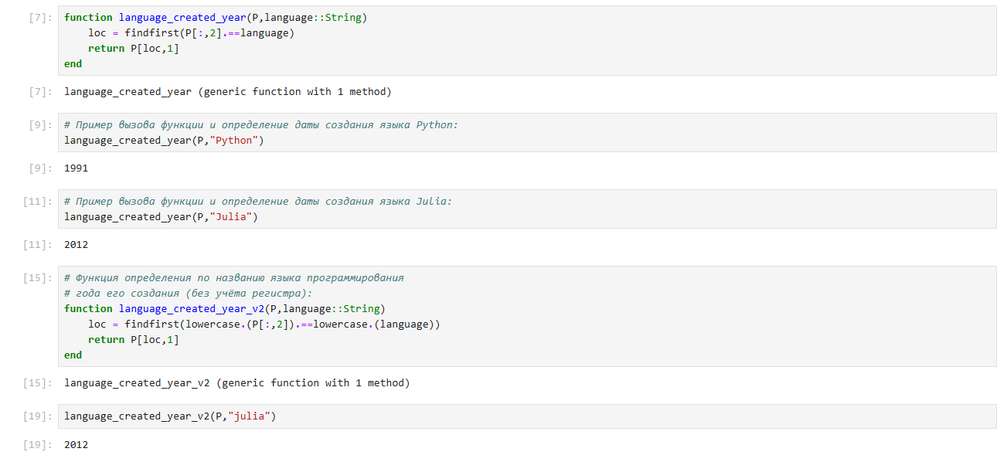{#fig:1 width=90%}

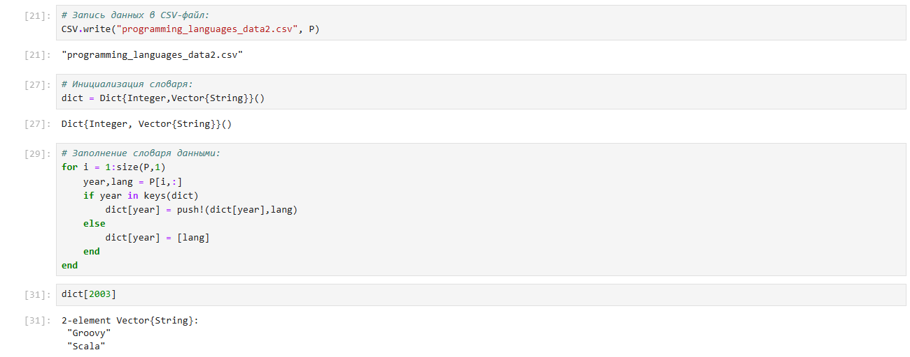{#fig:2 width=90%}

{#fig:3 width=90%}

{#fig:4 width=90%}

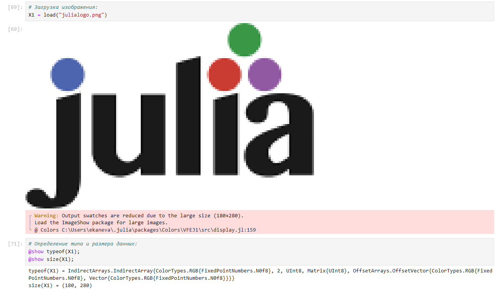{#fig:5 width=90%}

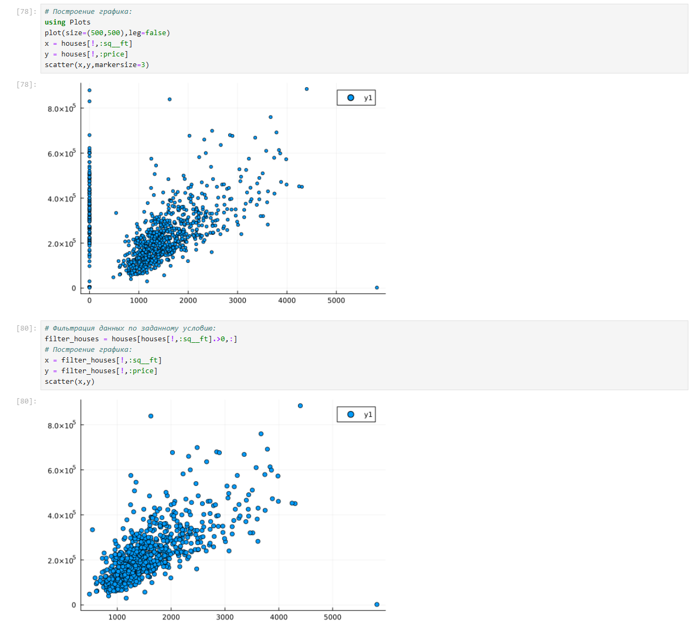{#fig:6 width=90%}

{#fig:7 width=90%}

## Задания для самостоятельной работы

Далее я приступила к выполнению заданий для самостоятельной работы.

### Задание 1

Загрузим

```Julia
using RDatasets
iris = dataset("datasets", "iris")
```

Используем Clustering.jl для кластеризации на основе k-средних. Сделаем точечную диаграмму полученных кластеров. Для этого проиндексируем фрейм данных, преобразуем его в массив и транспонируем.

Сначала загрузила данные и кластеризовала (рис. [-@fig:8]):

{#fig:8 width=90%}

Визуализировала кластеры (рис. [-@fig:9]):

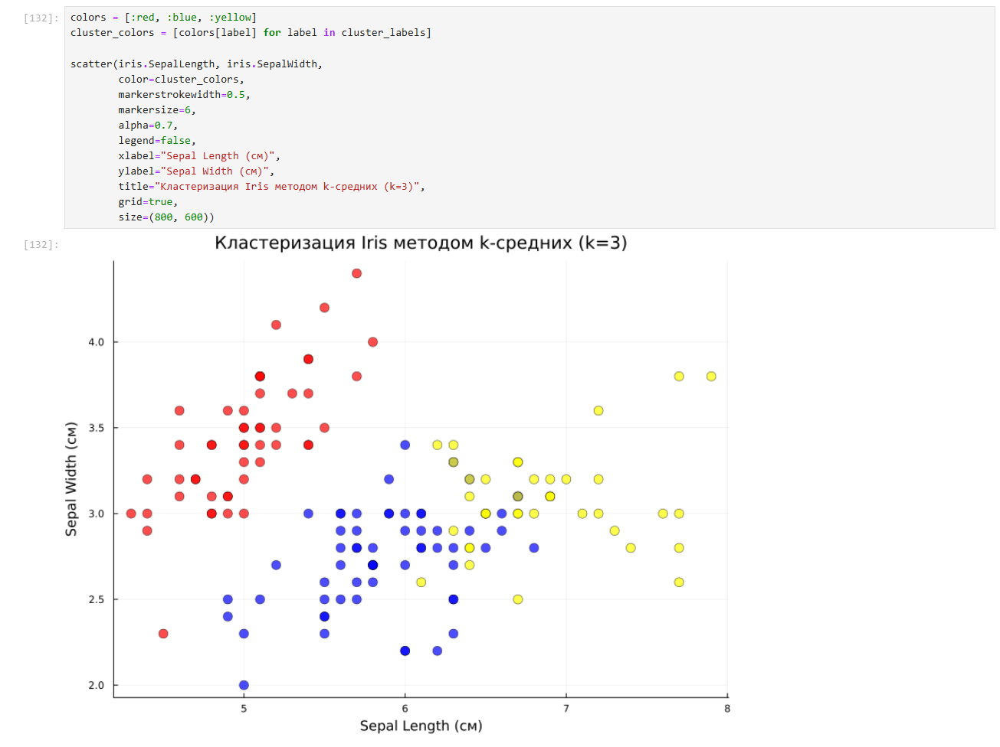{#fig:9 width=90%}

Добавила центроиды (рис. [-@fig:10]):

{#fig:10 width=90%}

Создала датафрейм с результатами кластеризации (рис. [-@fig:11]):

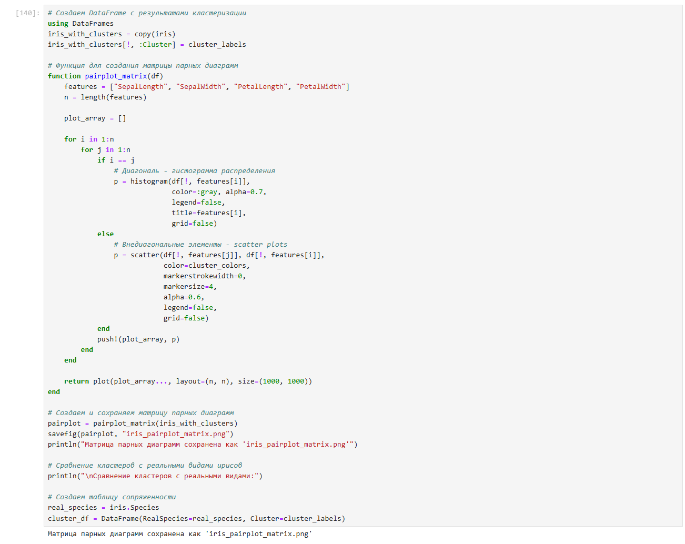{#fig:11 width=90%}

Сделала анализ качества кластеризации (рис. [-@fig:12]):

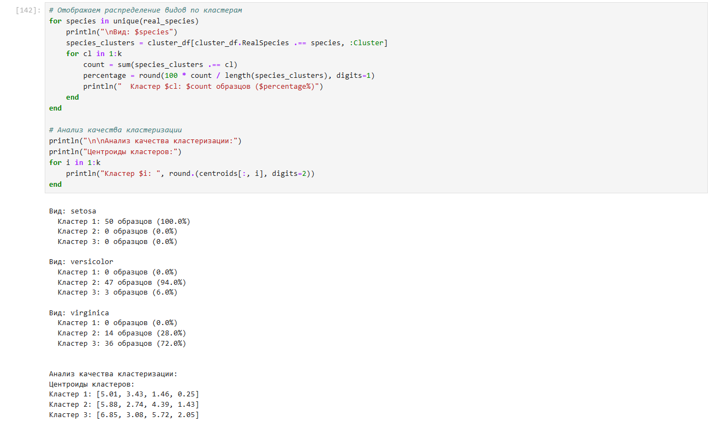{#fig:12 width=90%}

Вывела итоговую сводную информацию о кластерах (рис. [-@fig:13]):

{#fig:13 width=90%}

### Задание 2

Пусть регрессионная зависимость являетсял инейной. Матрица наблюдений факторов $X$ имеет размерность $N \times 3$ `randn (N, 3)`, массив результато в $N \times 1$, регрессионная зависимость является линейной. Найдем МНК-оценку для линейной модели:

- Сравним свои результаты с результатами использования `llsq` из
`MultivariateStats.jl`.
- Сравним свои результаты с результатамии спользования регулярной регрессии наименьших квадратов из `GLM.jl`.

Сгенерировала данные и сделала ручную оценку (рис. [-@fig:14]):

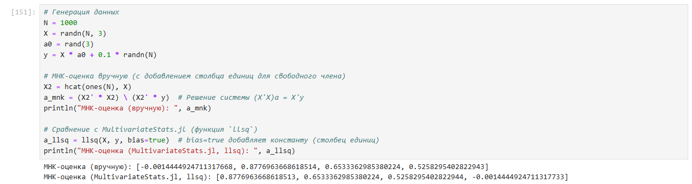{#fig:14 width=90%}

Сопоставила результаты (рис. [-@fig:15]):

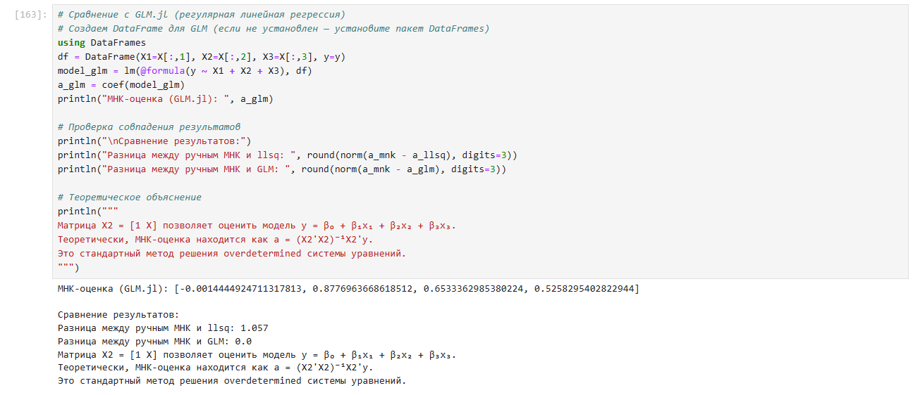{#fig:15 width=90%}

Далее нашла линию регрессии, используя данные (X, y). Построила график (X, y) с помощью точечного графика scatter plot. Добавила линию регрессии, используя функцию abline!. Также я добавила заголовок «График регрессии» и подписала оси x и y (рис. [-@fig:16]):

{#fig:16 width=90%}

### Задание 3

Построим траекторию возможных цен на акции:

- $S$ -- начальная цена акции;
- $T$ -- длина биномиального дерева в годах;
- $n$ -- количество периодов;
- $h = Tn$ -- длина одного периода;
- $\sigma$ -- волатильность акции;
- $r$ -- годовая процентная ставка;
- $u = \mathrm{exp}(rh + \sigma \sqrt{h})$;
- $d = \mathrm{exp}(rh - \sigma \sqrt{h})$;
- $p^* = \dfrac{\mathrm{exp}(rh) -d}{u - d}$;

Пусть $S = 100, \, T = 1, \, n = 10000, \, \sigma = 0.3$ и $r = 0.08$. Попробуем  построить траекторию курса акций.

Построила модель ценообразования биномиальных опционов (рис. [-@fig:17]):

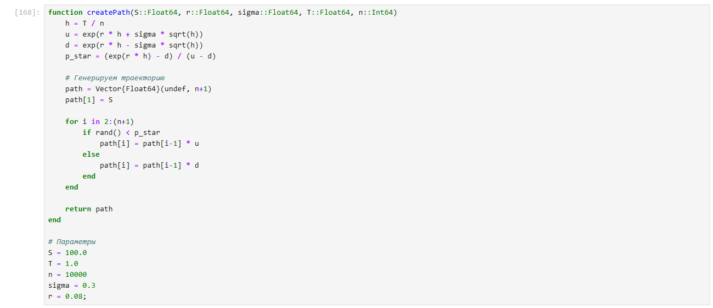{#fig:17 width=90%}

Построила график траектории цены акции (рис. [-@fig:18]):

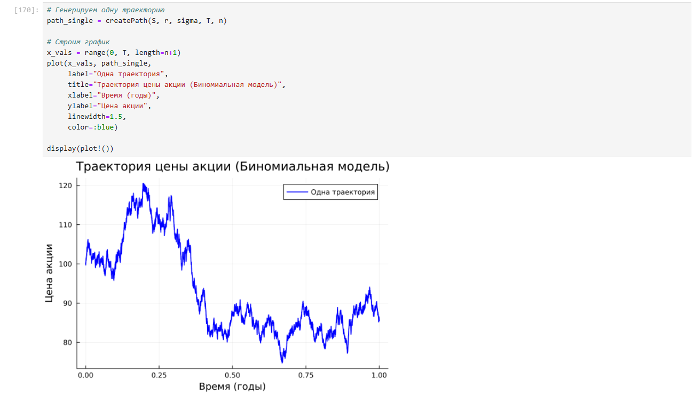{#fig:18 width=90%}

Создала функцию `createPath (S ::Float64, r ::Float64, sigma ::Float64, T ::Float64, n ::Int64)`, которая создает траекторию цены акции с учетом начальных параметров. С помощью `createPath` создала 10 разных траекторий и построила их все на одном графике (рис. [-@fig:19]-[-@fig:20]):

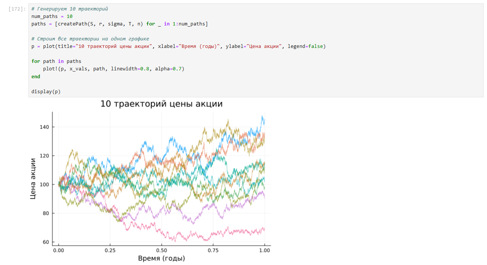{#fig:19 width=90%}

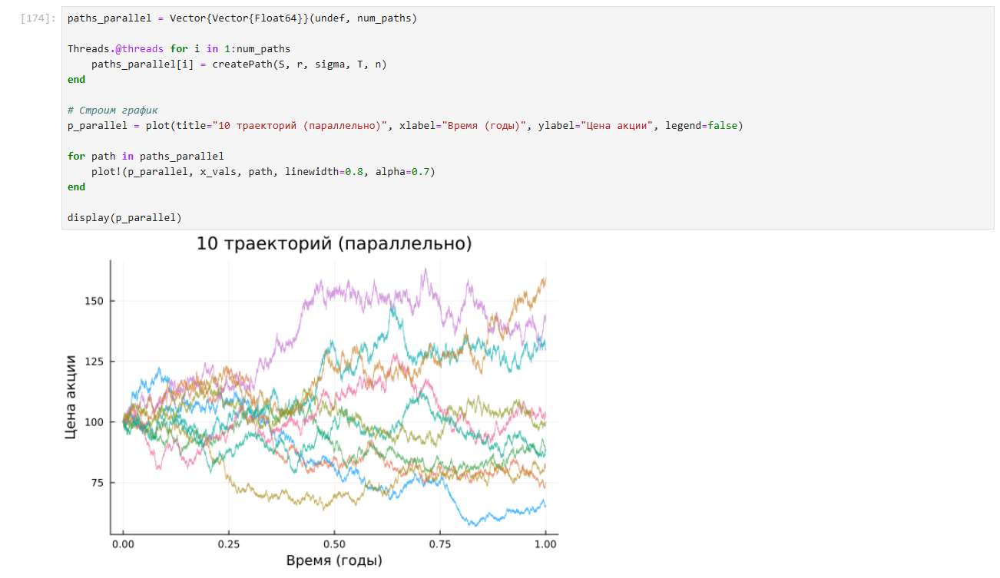{#fig:20 width=90%}

# Выводы

Освоила специализированные пакеты Julia для обработки данных.