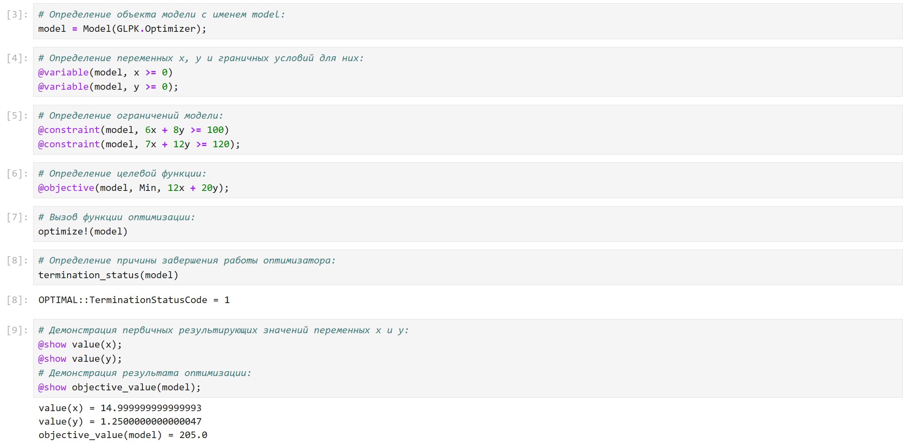
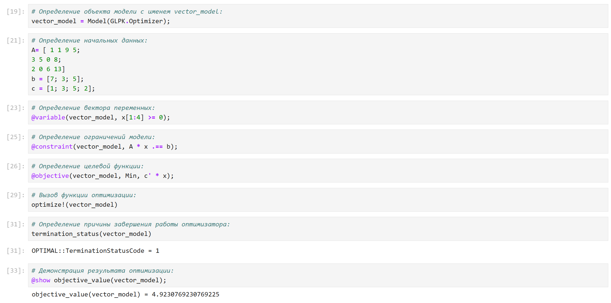
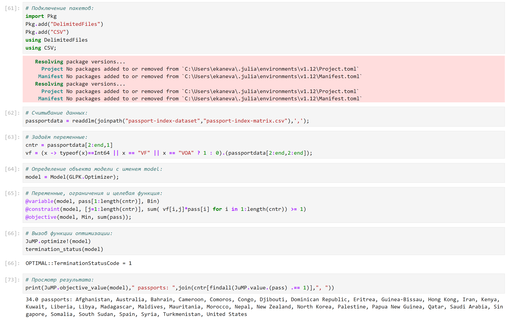
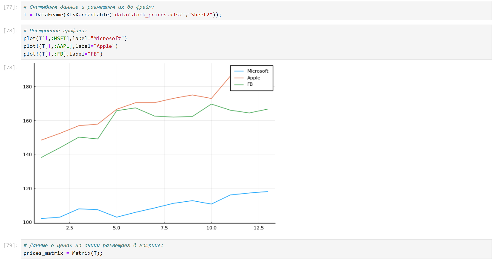
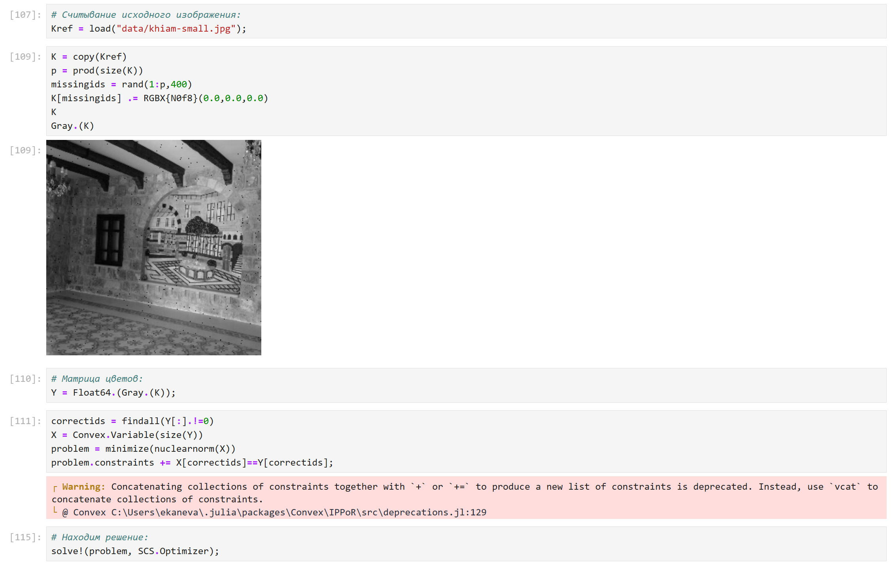
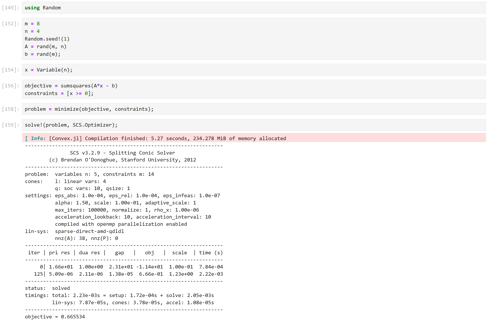
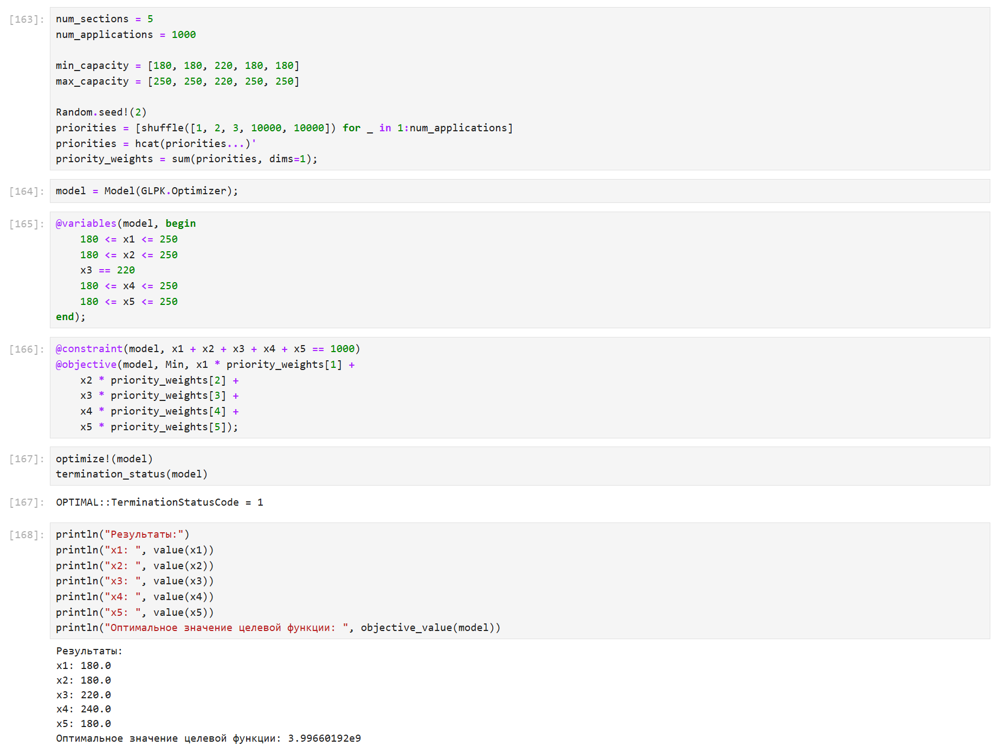

---
## Front matter
lang: ru-RU
title: Лабораторная работа №8
subtitle: Компьютерный практикум по статистическому анализу данных
author:
  - Канева Екатерина, НФИбд-02-22
institute:
  - Российский университет дружбы народов, Москва, Россия
date: 20 декабря 2025

## i18n babel
babel-lang: russian
babel-otherlangs: english

## Formatting pdf
toc: false
toc-title: Содержание
slide_level: 2
aspectratio: 169
section-titles: true
theme: metropolis
header-includes:
 - \metroset{progressbar=frametitle,sectionpage=progressbar,numbering=fraction}
---

# Информация

## Докладчик

* Канева Екатерина Павловна
* студент группы НФИбд-02-22
* Российский университет дружбы народов
* [1132222004@rudn.ru](mailto:1132222004@rudn.ru)
* <https://nevseros.github.io/ru/>

# Вводная часть

## Цель работы

Основной целью работы является освоение специализированных пакетов Julia для решения задач оптимизации.

## Задания

* Используя Jupyter Lab, повторить примеры.
* Выполнить задания для самостоятельной работы.

# Выполнение работы

# Примеры

## Примеры с линейным программированием

Выполнила примеры с линейным программированием:

{width=50%}

## Примеры с векторизованными ограничениями и целевой функцией оптимизации

Выполнила примеры с векторизованными ограничениями и целевой функцией оптимизации:

{width=50%}

## Пример по оптимизации рациона питания

Выполнила примеры по оптимизации рациона питания:

{width=50%}

## Пример по путешествию по миру

Выполнила пример по путешествию по миру:

{width=50%}

## Пример с портфельными инвестициями

Выполнила пример с портфельными инвестициями:

{width=50%}

## Пример с восстановлением изображения

Выполнила пример с восстановлением изображения:

{width=50%}

# Задания для самостоятельного выполнения

## Задание 1

Выполнила первое задание для самостоятельной работы:

{width=50%}

## Задание 2

Выполнила второе задание для самостоятельной работы:

{width=50%}

## Задание 3

Выполнила третье задание для самостоятельной работы:

{width=50%}

## Задание 4

Выполнила четвёртое задание для самостоятельной работы:

{width=50%}

## Задание 5

Выполнила пятое задание для самостоятельной работы:

{width=50%}

# Заключение

## Вывод

Освоила пакеты Julia для решения задач оптимизации.