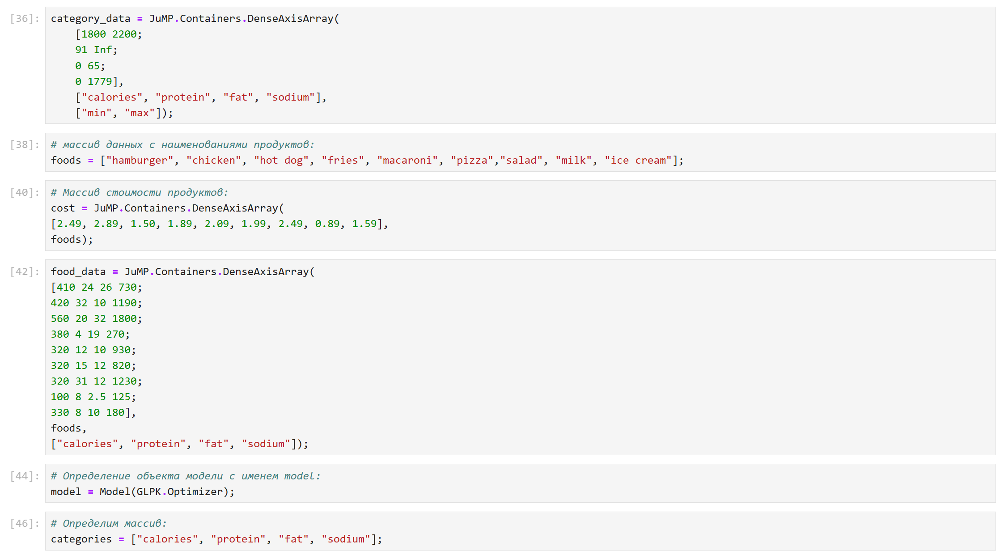
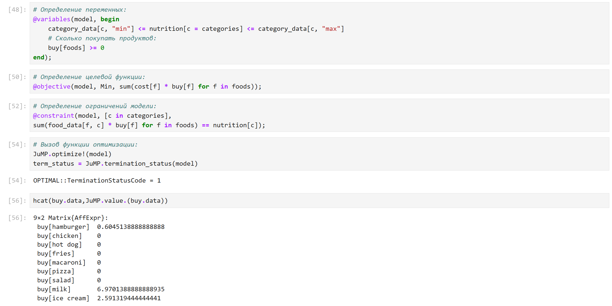
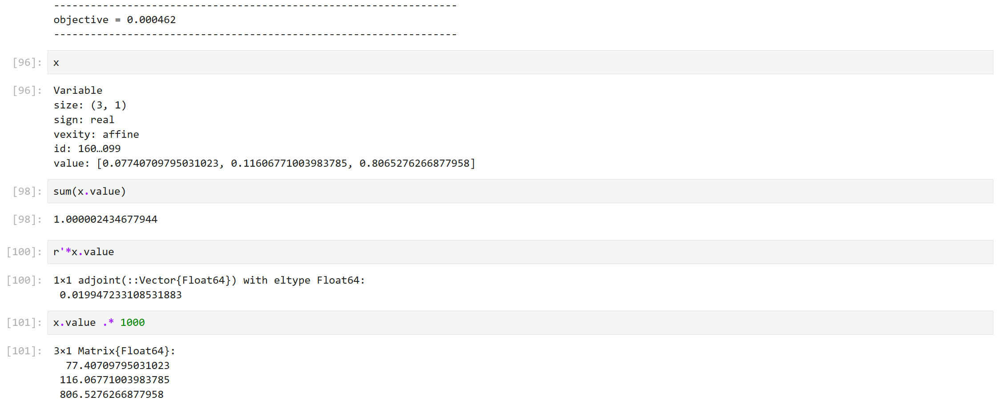
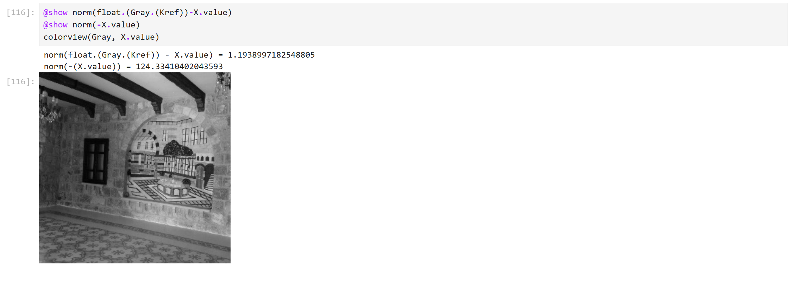
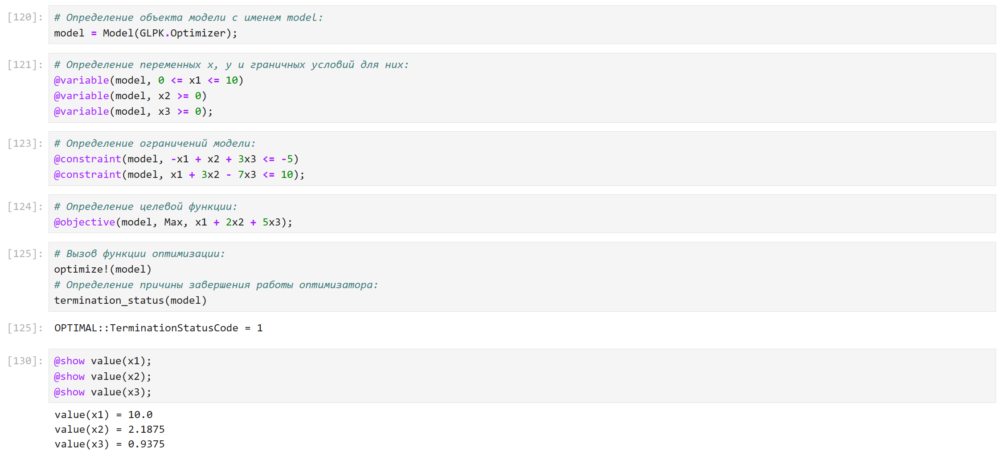
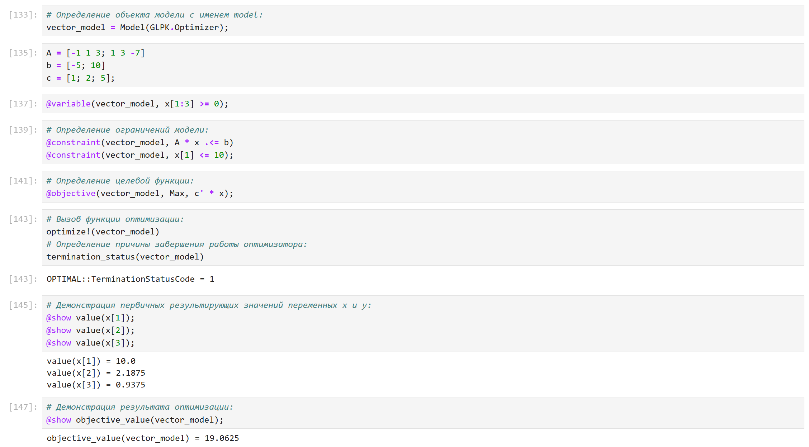
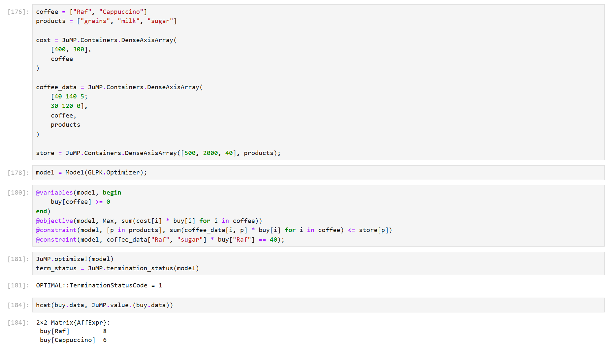

---
## Front matter
title: "Отчёт по лабораторной работе №8"
subtitle: "Компьютерный практикум по статистическому анализу данных"
author: "Канева Екатерина, НФИбд-02-22"

## Generic otions
lang: ru-RU
toc-title: "Содержание"

## Bibliography
bibliography: bib/cite.bib
csl: pandoc/csl/gost-r-7-0-5-2008-numeric.csl

## Pdf output format
toc: true # Table of contents
toc-depth: 2
lof: true # List of figures
lot: true # List of tables
fontsize: 12pt
linestretch: 1.5
papersize: a4
documentclass: scrreprt
## I18n polyglossia
polyglossia-lang:
  name: russian
  options:
	- spelling=modern
	- babelshorthands=true
polyglossia-otherlangs:
  name: english
## I18n babel
babel-lang: russian
babel-otherlangs: english
## Fonts
mainfont: IBM Plex Serif
romanfont: IBM Plex Serif
sansfont: IBM Plex Sans
monofont: IBM Plex Mono
mathfont: STIX Two Math
mainfontoptions: Ligatures=Common,Ligatures=TeX,Scale=0.94
romanfontoptions: Ligatures=Common,Ligatures=TeX,Scale=0.94
sansfontoptions: Ligatures=Common,Ligatures=TeX,Scale=MatchLowercase,Scale=0.94
monofontoptions: Scale=MatchLowercase,Scale=0.94,FakeStretch=0.9
mathfontoptions:
## Biblatex
biblatex: true
biblio-style: "gost-numeric"
biblatexoptions:
  - parentracker=true
  - backend=biber
  - hyperref=auto
  - language=auto
  - autolang=other*
  - citestyle=gost-numeric
## Pandoc-crossref LaTeX customization
figureTitle: "Рис."
tableTitle: "Таблица"
listingTitle: "Листинг"
lofTitle: "Список иллюстраций"
lotTitle: "Список таблиц"
lolTitle: "Листинги"
## Misc options
indent: true
header-includes:
  - \usepackage{indentfirst}
  - \usepackage{float} # keep figures where there are in the text
  - \floatplacement{figure}{H} # keep figures where there are in the text
---

# Цель работы

Основная цель работы — освоить пакеты Julia для решения задач оптимизации.

# Задание

* Используя Jupyter Lab, повторить примеры.
* Выполнить задания для самостоятельной работы.

# Теоретическая часть

Julia - высокоуровневый свободный язык программирования с динамической типизацией, созданный для математических вычислений. Эффективен также и для написания программ общего назначения. Синтаксис языка схож с синтаксисом других математических языков, однако имеет некоторые существенные отличия.

Для выполнения заданий была использована официальная документация Julia.

# Выполнение лабораторной работы

## Примеры

Сначала я выполнила примеры из лабораторной работы (рис. [-@fig:1]-[-@fig:9]):

{#fig:1 width=90%}

{#fig:2 width=90%}

{#fig:3 width=90%}

{#fig:4 width=90%}

{#fig:5 width=90%}

{#fig:6 width=90%}

{#fig:7 width=90%}

{#fig:8 width=90%}

{#fig:9 width=90%}

## Задания для самостоятельной работы

Далее я приступила к выполнению заданий для самостоятельной работы.

### Задание 1

Необходимо было решить задачу линейного программирования при заданных ограничениях. Решила задачу аналогично первому примеру из лабораторной (рис. [-@fig:10]):

{#fig:10 width=90%}

### Задание 2

Далее необходимо было решить ту же задачу линейного программирования при заданных ограничениях, как в задании 1, но с массивами. Решила задачу аналогично второму примеру из лабораторной (рис. [-@fig:11]):

{#fig:11 width=90%}

### Задание 3

Необходимо было решить задачу выпуклого программирования - решить задачу оптимизации. Решила задачу аналогично примерам из первой части лабораторной (рис. [-@fig:12]):

{#fig:12 width=90%}

### Задание 4

Необходимо было решить задачу оптимальной рассадки по залам. Решила задачу аналогично примерам из первой части лабораторной (рис. [-@fig:13]):

{#fig:13 width=90%}

### Задание 5

Необходимо было решить задачу о плане приготовления кофе. Решила задачу аналогично примеру о портфельных инвестициях из лабораторной (рис. [-@fig:14]):

{#fig:14 width=90%}

# Выводы

Освоила пакеты Julia для решения задач оптимизации.